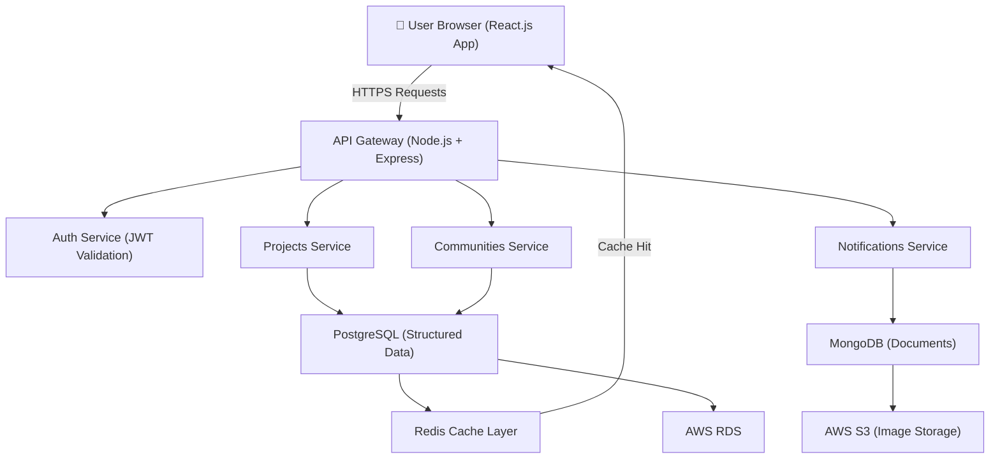
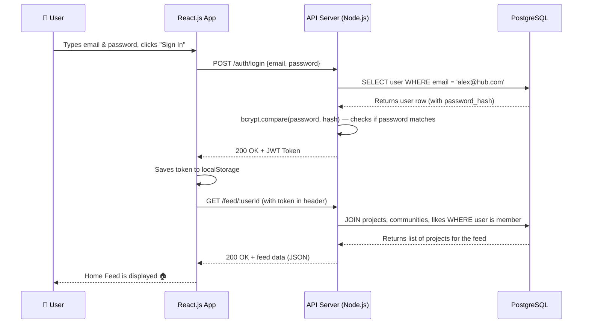
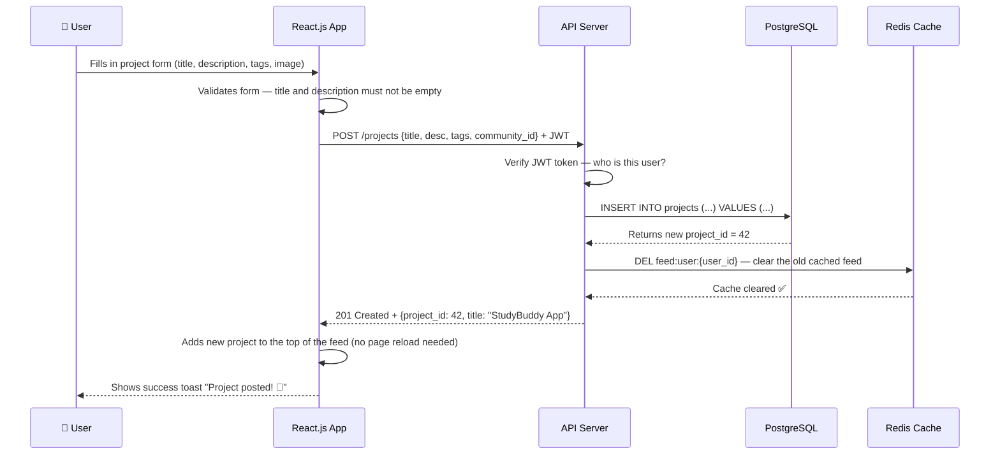
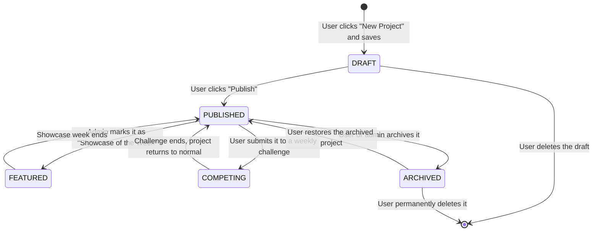
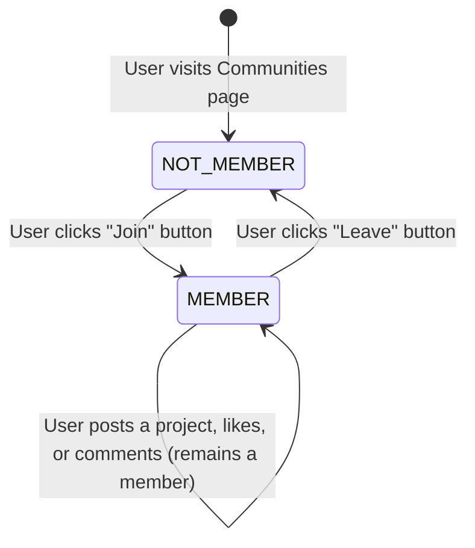
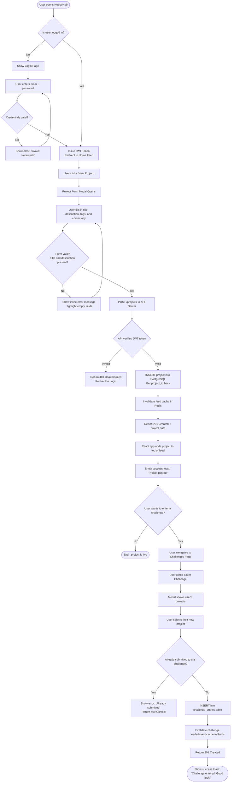
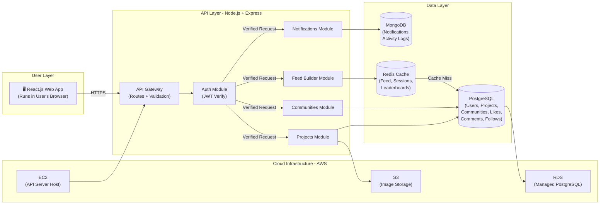

# HobbyHub — Product Requirements Document (PRD)

**Product:** HobbyHub — Social Platform for Hobby & Project Sharing
**Classes:** FESE304 (Database Management System) & FESE305 (Software App Dev Studio)
**Frontend:** React.js (Web App, not mobile app)
**Presentation Format:** 30-minute engineering hand-off + 10-minute Q&A
**Date:** March 2026
**Status:** MVP Ready for Engineering Hand-off

> **How to read this document:** Every section is written in simple, plain English.
> When a technical term is used, it is explained right after in everyday words.
> This document is designed so a developer, professor, and non-technical investor can all understand it equally well.

---

## Grading Rubric Map

This table shows exactly where each graded section lives in this document.

| Grading Section | Points | Where to Find It |
|---|---|---|
| **1. Big Picture & Requirements** | 15 pts (FESE305) | Section 1 (Problem), Section 2 (MVP), Section 3 (Requirements) |
| **2. User Experience & Flow** | 10 pts (FESE305) | Section 4 (UX, Pages, Colors, User Journeys, Wireframes) |
| **3. Architecture & Logic** | 15 pts (FESE305) | Section 5 (System, Diagrams) |
| **4. Data Modeling & DB Design** | 20 pts (FESE304) | See `02_DATABASE_DESIGN_DOCUMENT.md` |
| **5. DB Implementation & Optimization** | 20 pts (FESE304) | See `02_DATABASE_DESIGN_DOCUMENT.md` |
| **6. QA & Post-Launch** | 10 pts (FESE305) | Section 6 (Testing, KPIs) |
| **7. Delivery & Q&A Defense** | 10 pts (Joint) | Section 7 (Presentation Plan & Defense Prep) |

---

## SECTION 1 — Big Picture & Requirements *(15 pts — FESE305)*

---

### 1A. Problem & Value *(5 pts)*

#### The Problem We Are Solving

Today, most social media platforms are built for everyone — which means they end up serving no one particularly well. College students and hobbyists who want to share their creative projects (art, code, music, games) find that their posts get buried under celebrity news, viral memes, and influencer content. There is no dedicated, safe space for them to show their work, find teammates, and grow their skills.

Here are **4 specific, real-world problems** our users face every day:

1. **"My project post gets no views."** — A 2nd-year game design student posts their Unity prototype on Instagram. Within 30 minutes, it disappears below 50 other posts in their followers' feeds. Nobody sees it. Nobody gives feedback. They lose motivation.

2. **"I can't find anyone to collaborate with."** — A music producer needs a vocalist for their new album. They post on Reddit. They get zero relevant replies and two spam messages. There is no filter, no profile, no shared context to find the right person quickly.

3. **"Weekly challenges don't exist anywhere for students."** — Creative students have no structured way to push themselves. Hackathons happen once a year; everything else is unstructured. There is nothing that gives a weekly creative nudge with a community rooting for them.

4. **"I want to build a startup but I don't know anyone."** — A Computer Science student with a real app idea has no way to find a co-founder, no way to show their portfolio credibly, and no community that bridges technical and non-technical students.

#### Target Personas

**Persona 1: Alex Chen — The Aspiring Startup Founder**
- Age: 21 | Major: Computer Science | Year: 3rd Year
- Tech Literacy: High — builds full-stack apps, uses GitHub daily
- Top 3 Frustrations:
  - Cannot find a designer or business partner on campus
  - LinkedIn feels too formal; Instagram is too casual
  - Gets no genuine feedback on his technical projects
- Success Looks Like: Posts his StudyBuddy App, gets 3 connection requests from designers within a week, and finds a co-founder through HobbyHub.

**Persona 2: Mia Torres — The Digital Artist**
- Age: 20 | Major: Fine Arts | Year: 2nd Year
- Tech Literacy: Medium — comfortable with Figma and social media, less comfortable with code
- Top 3 Frustrations:
  - Her art gets lost in the noise on general social platforms
  - Hard to find clients or collaborators who appreciate creative work
  - No structured feedback — comments are usually just emoji reactions
- Success Looks Like: Shares her Campus Life Illustrations series, gets meaningful written comments, and gets commissioned for a project through a connection she made on HobbyHub.

**Persona 3: Leo Park — The Music Producer**
- Age: 23 | Major: Music Technology | Year: 4th Year
- Tech Literacy: Medium — uses DAW software (Ableton), comfortable with streaming platforms
- Top 3 Frustrations:
  - No one to collaborate with on campus for music projects
  - SoundCloud is competitive and not campus-focused
  - Challenge/competition events are rare and hard to find
- Success Looks Like: Joins the "Music Lab" community, enters the weekly jingle challenge, and finds a vocalist to collaborate with for his final semester project.

#### Business Justification

**Is this a real business opportunity?**

[ASSUMPTION] The global social media market is valued at over $230 billion in 2024. The niche of creative, project-sharing communities for students and hobbyists is largely unserved by existing giants. Platforms like Behance are portfolio-focused (not social), Reddit is unstructured (no profiles), and LinkedIn is too formal. HobbyHub targets college students ages 18–28, a segment of approximately 220 million college students worldwide.

**Key Differentiator vs. Competitors:**

| Platform | What It Does Well | What It Misses |
|---|---|---|
| **Behance** | Portfolio display | No community, no challenges, no real-time social feed |
| **Reddit** | Community discussion | No user profiles, no project structure, no collaborator discovery |
| **LinkedIn** | Professional networking | Too formal, no hobby/creative focus, intimidating for students |
| **HobbyHub** | **All of the above in one place** | — |

**Our unique advantage:** HobbyHub is the only platform that combines project showcasing + community building + weekly challenges + structured collaborator discovery — all specifically designed for students and hobbyists.

#### Risk & Mitigation Table

| Risk | Likelihood | Impact | Mitigation Strategy | Owner |
|---|---|---|---|---|
| Low initial user adoption | High | High | Launch with campus ambassador program at 3 universities | Product Team |
| Content quality drops over time | Medium | High | Weekly challenges keep users creating; community moderation rules | Community Team |
| Privacy concerns with student data | Medium | High | GDPR-compliant data handling, clear privacy policy | Engineering |
| Competition from large platforms adds similar features | Medium | Medium | Move fast on niche features; build community loyalty early | PM |
| Premium plan fails to convert free users | High | Medium | Offer 1-month free trial of Premium on signup | Business |

**Feasibility & Next Steps:** HobbyHub is technically feasible to build with a small team using React.js (front-end), Node.js (back-end), and PostgreSQL (database) — all widely supported and well-documented technologies. The MVP can be built in 8 weeks by a team of 4 developers. The immediate next step is to finalize the database schema (Section 6 in the DB Design Document) and set up the development environment.

---

### 1B. Scope & MVP *(5 pts)*

#### Jobs-To-Be-Done (JTBD)

These are the core real-world tasks our users are trying to complete. We build features to serve these jobs.

1. *"When I finish a creative project, I want to share it with people who actually care about the same hobby, so I can get real feedback and feel recognized."*
2. *"When I'm starting a startup idea, I want to find teammates with complementary skills, so I don't have to build everything alone."*
3. *"When I feel creatively stuck, I want a structured challenge to push me, so I stay motivated and keep improving."*
4. *"When I browse my feed, I want to see projects from communities I care about, so I don't waste time on irrelevant content."*
5. *"When I discover someone whose work I admire, I want to follow them and stay updated on what they build next, so I can grow my own creative network."*

#### Prioritized User Stories (MoSCoW)

| ID | User Story | Priority | Acceptance Criteria | Linked Requirement |
|---|---|---|---|---|
| US-01 | As a student, I want to register and create a profile so I can join the HobbyHub community. | Must-Have | Email + password signup works; profile is created in DB; user is redirected to home feed. | FR-01 |
| US-02 | As a creator, I want to post a project with a title, description, tags, and an image so others can see my work. | Must-Have | Form accepts text and image; post appears in feed within 5 seconds; error shown if title is missing. | FR-03 |
| US-03 | As a hobbyist, I want to browse and join communities that match my interests so I can find like-minded people. | Must-Have | Communities list shows name, member count, and description; join button works; user sees community in sidebar. | FR-04 |
| US-04 | As a user, I want to like a project so I can show appreciation to the creator. | Must-Have | Like button toggles; count updates immediately; duplicate likes are prevented. | FR-05 |
| US-05 | As a user, I want to comment on a project so I can give useful feedback. | Must-Have | Comment box visible on project detail; comment saves and appears immediately; creator is notified. | FR-06 |
| US-06 | As a potential collaborator, I want to search for users by skill so I can find the right teammate. | Must-Have | Search bar on Directory page filters users by skill tag in real-time. | FR-07 |
| US-07 | As a creator, I want to participate in weekly challenges so I stay motivated and gain visibility. | Should-Have | Challenge list shows title, deadline, and participant count; submit project button works. | FR-08 |
| US-08 | As a user, I want to receive notifications when someone likes or comments on my project so I know people are engaging. | Should-Have | Notification bell shows unread count; notification list shows event, actor name, and time. | FR-10 |
| US-09 | As a user, I want to follow other creators so I can see their latest projects in my feed. | Should-Have | Follow button toggles on Directory and Profile pages; following list is stored. | FR-11 |
| US-10 | As a premium user, I want a verified badge on my profile so others know I'm a serious creator. | Could-Have | Badge is displayed next to username on posts, profile, and directory cards. | FR-12 |

#### MVP Boundary Statement

The HobbyHub MVP (Minimum Viable Product — the smallest version of the product that still delivers real value) includes: user registration, profile creation, project posting, community join/leave, likes, comments, user search, and basic notifications. **Beyond this line, features are not included in MVP.** Challenge submission is a "should-have" that will be included in MVP because it is a key engagement driver. Features like direct messaging, portfolio builder, premium billing integration, mobile app, email digests, and AI-powered recommendations are explicitly not in this version. The MVP is designed to prove one thing: that students will create, share, and engage with each other's work in a structured community environment.

#### Out-of-Scope (Not in MVP)

- **Direct Messaging (DMs):** Complex feature; community comments serve the collaboration need for now.
- **Email Digest / Newsletter:** Needs email infrastructure; deferred to Phase 2.
- **Mobile App (iOS/Android):** The web app is responsive and works well on phones; a native app is Phase 3.
- **AI-Powered Recommendations:** Requires training data that we don't have at launch.
- **Payment / Stripe Integration:** Premium badge will be manually assigned by admin for beta testing.
- **Portfolio Builder:** Advanced feature for Phase 2 after we understand user content patterns.

**Feasibility & Next Steps:** The MVP feature set can be delivered in 6–8 weeks. The next step is for engineering to set up the React.js project with Vite (already done in this codebase) and the Node.js + Express API server, and for the DB team to run the schema creation scripts from the Database Design Document.

---

### 1C. Functional & Non-Functional Requirements *(5 pts)*

#### Functional Requirements — What the System MUST Do

*(A functional requirement is a specific, testable thing the system must be able to do.)*

| ID | Requirement | Plain-English Description | Linked User Story | How to Test It |
|---|---|---|---|---|
| FR-01 | User Registration & Auth | A new user can create an account with email and password. The system stores a hashed (scrambled, unreadable) password. User receives a login token. | US-01 | POST `/auth/signup` → verify user record in DB, token returned in response |
| FR-02 | User Profile Management | A logged-in user can edit their username, bio, skills list, and avatar. Changes must be saved and visible immediately. | US-01 | PATCH `/users/:id` → verify DB record updated, profile page shows new data |
| FR-03 | Project Post (CRUD) | A user can Create, Read, Update, and Delete their own project posts. Each post has a title, description, tags, image, and community selection. | US-02 | Test all 4 endpoints: POST, GET, PATCH, DELETE for `/projects` |
| FR-04 | Community Membership | Users can browse all communities, search by keyword, join with one click, and leave at any time. The system tracks who is in which community. | US-03 | POST `/communities/:id/join` → confirm membership row in DB |
| FR-05 | Like System | One user can like a project exactly once. Clicking again removes the like. The like count updates immediately on screen. | US-04 | POST `/projects/:id/likes` twice → second attempt returns 409 Conflict |
| FR-06 | Comment System | Users can add comments to any published project. Comments are shown in order with the author's name and time. | US-05 | POST `/projects/:id/comments` → comment appears in GET response |
| FR-07 | Search | Users can search for projects, other users, and communities using a keyword. Results are filtered and sorted by relevance. | US-06 | GET `/search/users?q=React` → returns users with "React" in skills |
| FR-08 | Weekly Challenges | The system shows active challenges with a countdown timer and participant count. Users can submit an existing project as their entry. | US-07 | GET `/challenges/active` → list returned; POST `/challenges/:id/entries` → entry created |
| FR-09 | Showcase of the Week | An admin can mark one project per week as "featured." Featured projects appear at the top of the home feed. | US-10 | PATCH `/admin/projects/:id/feature` → `is_featured` flag set to `true` in DB |
| FR-10 | In-App Notifications | The system automatically creates a notification when someone likes, comments on, or follows a user. Users can see and dismiss notifications. | US-08 | Action (like) → notification document created in MongoDB → GET `/notifications` returns it |
| FR-11 | Follow System | A user can follow another user. Followers see the followed user's new projects in their home feed. | US-09 | POST `/users/:id/follow` → row in `follows` table; feed query returns followed user's projects |
| FR-12 | Premium Badge Display | Users on the "premium" plan display a verified badge (★★) next to their name everywhere their profile appears. | US-10 | Set `plan_type = 'premium'` in DB → badge visible on profile and post cards |

#### Non-Functional Requirements — How WELL the System Performs

*(A non-functional requirement describes the quality, speed, or safety of the system — not just what it does, but how well it does it.)*

| ID | Requirement | Plain-English Description | Target Metric | How to Test It |
|---|---|---|---|---|
| NFR-01 | **Performance** | The home feed must load fast. Nobody wants to wait more than 3 seconds for a page to appear. | API response < 300ms at p95 (95% of users experience this or better) | Load test with k6 simulating 500 concurrent users |
| NFR-02 | **Scalability** | The system must handle a lot of people using it at the same time — imagine everyone in a university opening the app at once. | Support 10,000 concurrent users without crashing | Stress test; add Redis caching for feed queries |
| NFR-03 | **Security** | All passwords must be scrambled (hashed using bcrypt) before being saved. User sessions must automatically expire after 7 days. | 0 plain-text passwords in DB; tokens expire in 7 days | Security audit; check DB; test expired token returns 401 |
| NFR-04 | **Availability** | The app must almost always be online. If it goes down, it should come back up quickly and automatically. | 99.5% uptime (less than 44 hours of downtime per year) | Monitoring with AWS CloudWatch alerts |
| NFR-05 | **Usability / Accessibility** | The app must work equally well on phones, tablets, and laptops. Text must be large enough to read, and buttons must be easy to tap. | Works on screens 320px to 1920px wide; text contrast ratio ≥ 4.5:1 | Test on 3 real devices; run Lighthouse accessibility audit |
| NFR-06 | **Compliance / Privacy** | Users must be able to delete their own account and all their data. The system must not share data with third parties without permission. | Account deletion removes all user data within 24 hours | Test DELETE `/users/:id` → verify all related rows removed from all tables |

**Feasibility & Next Steps:** All non-functional requirements are achievable with the chosen technology stack (React.js, Node.js, PostgreSQL, Redis). NFR-01 and NFR-02 are the most critical to test before launch. The next step is to write load tests using the k6 tool targeting the feed endpoint, which is the most accessed API in the system.

---

## SECTION 2 — User Experience & Flow *(10 pts — FESE305)*

---

### 2A. User Journeys & Information Architecture

#### User Journey 1: Alex (Startup Founder) — Posts His First Project

**Trigger:** Alex finishes his "StudyBuddy App" prototype and wants feedback.

| Step | What Alex Does | What the App Does | Emotional Tone |
|---|---|---|---|
| 1 | Opens HobbyHub and logs in | App verifies token and loads his personalized home feed | 😐 Neutral — just getting started |
| 2 | Clicks "New Project" button | A form modal (pop-up window) appears with fields for title, description, tags, and image | 😊 Hopeful — excited to share |
| 3 | Fills in the form and selects "Code & Create" community | Real-time validation checks that title and description are not empty | 😊 Focused — in the zone |
| 4 | Clicks "Submit" | App sends the data to the server. A loading spinner appears briefly. | 😐 Slightly anxious — waiting |
| 5 | Feed refreshes, his project card appears at the top | Success toast notification: "Project posted! 🎉" | 😍 Excited — it worked! |
| 6 | Within 24 hours, a notification appears: "Mia Torres liked your project" | He clicks the notification; it opens the project detail page with Mia's comment | 😍 Grateful — feeling validated |

**End State:** Alex's project is live, he has 3 comments and 7 likes within 24 hours.

---

#### User Journey 2: Mia (Artist) — Joins a Community and Discovers Projects

**Trigger:** Mia opens HobbyHub for the first time after signing up.

| Step | What Mia Does | What the App Does | Emotional Tone |
|---|---|---|---|
| 1 | Lands on the Communities page from the sidebar | Sees a grid of communities with cover images and logos | 😐 Curious — exploring |
| 2 | Searches "Art" in the search bar | Results filter in real-time: "Art Studio" appears as the top match | 😊 Interested — found it |
| 3 | Clicks on "Art Studio" community | A community detail page opens with a cover banner, member count, and all community posts | 😊 Engaged — feels right |
| 4 | Clicks "Join Community" | Button changes to "Joined ✅"; community appears in sidebar. Toast: "You joined Art Studio!" | 😍 Belonging — feels welcomed |
| 5 | Scrolls through the feed, finds a project she loves | She clicks the ❤️ like button | 😊 Appreciative — giving back |
| 6 | Leaves a comment with feedback | Comment appears instantly below the project | 😊 Confident — contributing |

**End State:** Mia is now a member of "Art Studio," has liked 3 projects, and left her first comment.

---

#### User Journey 3: Leo (Music Producer) — Enters a Weekly Challenge

**Trigger:** Leo sees a notification: "New challenge is live in Music Lab."

| Step | What Leo Does | What the App Does | Emotional Tone |
|---|---|---|---|
| 1 | Clicks the notification | App navigates to the Challenges page, scrolling to the active "Compose a 60-sec Jingle" challenge | 😐 Curious — wondering what it is |
| 2 | Reads the challenge description and deadline | Challenge card shows prize: "Studio Session Credit," 29 participants, 7 days left | 😊 Motivated — likes the challenge |
| 3 | Clicks "Enter Challenge" | A modal appears asking him to select an existing project or post a new one | 😐 Thinking — which project? |
| 4 | Selects his "LoFi Beat Pack Vol.2" project | Entry is confirmed. Toast: "Challenge entered! Good luck! 🎶" | 😍 Excited — ready to compete |
| 5 | Checks the leaderboard every day | Leaderboard shows his entry ranked by likes in real-time | 😊 Competitive — motivated to keep going |

**End State:** Leo's entry is submitted. He is ranked #1 after 4 days with 203 likes.

---

#### Information Architecture Map

This shows the full navigation structure of the HobbyHub app — how every page connects to every other page.

```
HobbyHub App
├── 🔐 Login / Registration Page
│   ├── Email + Password Login Form
│   ├── Sign Up Form
│   └── [Redirects to Home after success]
│
├── 🏠 Home Page (Main Feed)
│   ├── Active Challenge Banner (with countdown)
│   ├── Project Feed Cards (from joined communities)
│   │   ├── Like Button → toggles like
│   │   └── Comment Button → opens Comment Modal
│   └── Featured "Showcase of the Week" Project
│
├── 🌐 Communities Page
│   ├── Search Bar (filter by keyword)
│   ├── Community Grid (with cover image and logo)
│   │   ├── Join / Leave Button
│   │   └── Click → Community Detail Page
│   └── Community Detail Page
│       ├── Cover Banner + Community Logo
│       ├── Member Count & Description
│       ├── Community Feed (projects in this community)
│       └── "Post to this Community" Button → New Project Modal
│
├── 📂 Projects Page
│   ├── Filter Buttons (by type: Showcase / Startup)
│   ├── "New Project" Button → New Project Form Modal
│   └── Project Cards (all published projects)
│       ├── Like Button
│       └── Comment Button → Comment Modal
│
├── ⚡ Challenges Page
│   ├── Active Challenge Cards (title, prize, participants, deadline)
│   └── "Enter Challenge" Button → selects project to submit
│
├── 🤝 Directory Page (Find People)
│   ├── Search Bar (filter by name or skill)
│   └── User Cards
│       ├── "Connect" Button → toggles connection
│       └── "Follow" Button → toggles follow
│
├── 🔔 Notifications Page
│   ├── "Mark All Read" Button
│   └── Notification List (like, comment, follow, challenge, showcase)
│
└── 👤 Profile Page
    ├── Cover Banner + Avatar
    ├── Bio, Skills, and Stats (followers/following)
    ├── User's Own Projects Grid
    ├── "Edit Profile" (future feature)
    └── "Sign Out" Button
```

#### Navigation Principles

1. **Max 2 clicks to any feature.** From the Home page, no important action requires more than 2 clicks to reach.
2. **Mobile-first bottom nav.** On small screens (< 768px), the 3 most important pages (Home, Communities, Projects) are always visible. Other pages are one tap away in the "More" pop-up menu.
3. **Contextual actions stay in context.** The "Like" and "Comment" buttons are always on the project card — the user does not have to navigate to a separate page to engage.
4. **Sidebar stays fixed on desktop.** All 7 nav links are always visible on desktop so the user never feels lost.
5. **Confirmation toasts on every action.** Every action (liking, joining, posting) gives immediate visual feedback so the user knows it worked.

---

### 2B. Page Descriptions & Wireframes

#### Screen 1: Login / Registration Page

- **Purpose:** Let users sign in or create a new account.
- **Layout:** Centered dark card on the `#09090b` background. HobbyHub logo at the top. Email field, password field, and a "Sign In" button. A "Create Account" toggle below.
- **Key Interactions:** Clicking "Sign In" sends credentials to `/auth/login`. On success, user is redirected to Home. On failure, a red error message appears inline.
- **Responsive:** Full-width on mobile; centered max-width 400px card on desktop.
- **Accessibility:** All input fields have visible labels; error messages use red color AND an icon (not color alone).

#### Screen 2: Home Page (The Main Feed)

- **Purpose:** Show the user what's happening — new projects from communities they joined, active challenges, and featured content.
- **Layout:**
  - Top: A highlighted "Active Challenge" banner in a distinct card.
  - Middle: A horizontal row of 3 project cards (title, image placeholder, tags, like/comment count).
  - Bottom: A "Load More" button.
- **Key Interactions:** Like button updates count in real-time. Comment button opens a bottom slide-in modal. Challenge banner has a "Join Now" or "Joined ✅" button.
- **Responsive:** 3 columns on desktop, 1 column on mobile (cards stack vertically).
- **Color used:** Card background `#18181b`; borders `#27272a`; text `#fafafa`; muted details `#71717a`.

#### Screen 3: Communities Page

- **Purpose:** Help users discover and join hobby groups.
- **Layout:**
  - A search bar at the top.
  - A grid of community cards, each with a cover image (full-width photo banner), a circular community logo avatar below it, the community name, member count, and a Join/Leave button.
- **Key Interactions:** Clicking the card opens the Community Detail Page. Clicking "Join" toggles membership with a toast notification.
- **Responsive:** 2 columns on desktop, 1 column on mobile.

#### Screen 4: Projects Page

- **Purpose:** Browse all projects on the platform, regardless of community.
- **Layout:**
  - Filter pills at the top: "All", "Startup", "Showcase".
  - A "+ New Project" button in the top right.
  - A grid of project cards (colored image placeholder, title, author, tags, like count, comment count).
- **Key Interactions:** Filter pills re-render the list live. "+ New Project" opens a form modal. Project card is clickable to see full details with comments.

#### Screen 5: Challenges Page

- **Purpose:** Show ongoing creative competitions.
- **Layout:** Challenge cards with a colored banner, title, prize description, participant count, and a countdown ("3 days left"). An "Enter Challenge" button on each card.
- **Key Interactions:** "Enter Challenge" opens a modal that lets the user pick one of their existing projects to submit.

#### Screen 6: Directory Page (Find People)

- **Purpose:** Help users find collaborators and teammates.
- **Layout:**
  - Search bar (searches by name or skill).
  - User cards showing: avatar (initials-based with a color), name, major, year, skills tags, follower count, "Connect" button, "Follow" button.
  - Premium users have a "★★" badge.
- **Responsive:** 2 columns on desktop, 1 column on mobile.

#### Screen 7: Profile Page

- **Purpose:** A user's personal hub — their identity on the platform.
- **Layout:**
  - A full-width cover banner (colored gradient based on user's hue).
  - An avatar circle overlapping the bottom of the cover.
  - Name, major, year, bio text, skills tags.
  - Stats row: Followers / Following / Projects count.
  - A grid of the user's own projects below.
  - A "Sign Out" button at the bottom of the sidebar.

> 🔗 **Prototype Link:** [PLACEHOLDER — https://figma.com/your-hobbyhub-prototype]

**Feasibility & Next Steps:** All screens described above are already implemented in the React.js codebase as separate page components (e.g., `HomePage.jsx`, `CommunitiesPage.jsx`). The next step for the UX team is to build a Figma prototype that mirrors these screens and test it with 5 real students.

---

## SECTION 3 — Architecture & Logic *(15 pts — FESE305)*

---

### 3A. System Overview

#### Technology Stack

| Layer | Technology | Why We Chose It (Plain English) |
|---|---|---|
| **Frontend** | React.js 18 + Vite | React.js lets us build interactive UIs efficiently. Vite makes development much faster by serving files instantly during development. |
| **Styling** | Inline CSS with a design token system (theme.js) | A central `theme.js` file stores all colors. This means changing one color value updates it everywhere in the app. |
| **API Server** | Node.js + Express.js | Node.js is fast and widely used. Express makes it easy to define routes like `GET /projects` and `POST /auth/login`. |
| **Authentication** | JWT Tokens (JSON Web Tokens) | JWTs let the server verify who the user is without checking the database on every single request. They expire automatically after 7 days. |
| **Primary Database** | PostgreSQL | PostgreSQL is a reliable, powerful relational database (stores data in tables with rows and columns). It's great for structured data like users, posts, and likes. |
| **Document Store** | MongoDB | MongoDB stores data as flexible "documents" (like JSON objects). It's perfect for notifications, which have different shapes depending on the notification type. |
| **Cache** | Redis | Redis stores frequently-needed data in memory (RAM), which is much faster than reading from the main database. We use it for the home feed. |
| **Cloud Infrastructure** | AWS (EC2 + RDS + S3 + ElastiCache) | AWS is the industry standard for hosting. EC2 runs our Node.js server, RDS runs our PostgreSQL database, S3 stores images, and ElastiCache runs Redis. |

#### System Architecture Diagram



**In plain English:** The user's browser (React.js app) sends requests over the internet to our API server. The server checks the user's identity (Auth), then calls the right service depending on what the user wants (projects, communities, notifications). Structured data goes to PostgreSQL; notification data goes to MongoDB. Redis sits in the middle, storing recently-fetched feed data so we don't have to query the database every single time.

---

### 3B. Sequence Diagrams

#### Sequence Diagram 1: User Login Flow



#### Sequence Diagram 2: Posting a Project



---

### 3C. State Transition Diagrams

#### State Diagram: Project Lifecycle

A "project" in HobbyHub is not just one static thing. It moves through different states depending on what the user or admin does with it.



**State Transitions Explained:**
- **DRAFT → PUBLISHED:** The user clicks "Publish" on their project. It is now visible on the community feed.
- **PUBLISHED → FEATURED:** An admin selects it as the best project of the week. It gets a "Showcase" banner and appears at the top of the home feed.
- **PUBLISHED → COMPETING:** A user submits it to an active challenge. It now appears in the challenge leaderboard.
- **PUBLISHED → ARCHIVED:** The user wants to hide the project without deleting it. It disappears from the feed but can be restored.
- **FEATURED / COMPETING → PUBLISHED:** When the special period ends (showcase week, challenge deadline), the project goes back to its normal published state.

#### State Diagram: Community Membership



**Plain English:** A user starts as "not a member" of any community. They can join (becoming a "member") or leave at any time. Free users can join a maximum of 3 communities; premium users have unlimited memberships.

**Feasibility & Next Steps:** The state diagrams above directly map to the `status` column in the `projects` table and the presence/absence of rows in the `memberships` table. The next engineering step is to write test cases that verify each state transition is correctly handled by the API server.

---

## SECTION 4 — QA & Post-Launch *(10 pts — FESE305)*

---

### 4A. Testing Strategy

*(QA = Quality Assurance. It means making sure the app works correctly before real users use it.)*

| Testing Type | What It Checks (Plain English) | Tools Used | Who Runs It | Pass Criteria |
|---|---|---|---|---|
| **Unit Testing** | Tests one small function at a time. For example: "Does the like-toggle function correctly add 1 to the count?" | Jest (JavaScript testing library) | Developers | 80%+ of functions are covered by tests |
| **Integration Testing** | Tests that different parts work together. For example: "When the React app calls the API, does the API correctly talk to the database?" | Postman (API tester), Supertest | Developers + QA | All 42 MVP API endpoints return the correct status codes |
| **End-to-End (E2E)** | Simulates a real user doing a full task — from logging in, to posting a project, to receiving a like notification — all automatically. | Playwright or Cypress (web testing) | QA Team | All 5 critical user journeys complete without errors |
| **Load Testing** | Tests how the app behaves when many people use it at the same time. Like simulating 1,000 users all loading the home feed simultaneously. | k6 (load testing tool) | DevOps / Backend | 95% of requests respond in under 300ms with 1,000 concurrent users |
| **User Acceptance Testing (UAT)** | Real students use the app and tell us what's confusing or broken before we launch. | Manual, Google Forms for feedback | 10–15 Beta Students | 85% of users complete the "Post a Project" journey without needing help |

---

### 4B. KPIs & Feedback Loop

*(KPI = Key Performance Indicator. It's a number we track to know if our product is succeeding.)*

**KPI 1 — Daily Active Users / Monthly Active Users (DAU/MAU Ratio)**
$$\text{DAU/MAU Ratio} = \frac{\text{Users who open the app today}}{\text{Users who opened the app this month}} \times 100$$
- **Target:** ≥ 25% (industry average is about 20%; we aim for slightly above average)
- **Measured via:** Server-side session logs
- **Review Frequency:** Weekly

**KPI 2 — Project Post Rate**
$$\text{Post Rate} = \frac{\text{Total Projects Posted This Week}}{\text{Total Active Users This Week}} \times 100$$
- **Target:** ≥ 30% of active users post at least once per month
- **Measured via:** `projects` table — count of new rows per week
- **Review Frequency:** Weekly

**KPI 3 — Engagement Rate**
$$\text{Engagement Rate} = \frac{\text{Total Likes + Comments This Week}}{\text{Total Active Users This Week}} \times 100$$
- **Target:** ≥ 50% (meaning every active user leaves at least one like or comment per session on average)
- **Measured via:** `likes` and `comments` table row counts
- **Review Frequency:** Weekly

**KPI 4 — Community Join Rate**
$$\text{Join Rate} = \frac{\text{Users Who Joined at Least 1 Community}}{\text{Total Registered Users}} \times 100$$
- **Target:** ≥ 60% within the first week of sign-up
- **Measured via:** `memberships` table
- **Review Frequency:** Monthly

**KPI 5 — Challenge Participation Rate**
$$\text{Challenge Rate} = \frac{\text{Challenge Entries Submitted}}{\text{Active Users in Challenge Community}} \times 100$$
- **Target:** ≥ 20% of community members participate in each weekly challenge
- **Measured via:** `challenge_entries` table
- **Review Frequency:** Per-challenge (weekly)

**KPI 6 — API Response Latency (p95)**
$$\text{Feed Load Time}_{p95} < 300ms$$
- **Target:** 95% of users see their feed loaded in under 300 milliseconds
- **Measured via:** API server response time logs + Redis cache hit rate
- **Review Frequency:** Continuously (alerts fire if it exceeds 500ms)

**KPI 7 — Free-to-Premium Conversion Rate**
$$\text{Conversion Rate} = \frac{\text{Users Who Upgrade to Premium}}{\text{Total Free Users}} \times 100$$
- **Target:** ≥ 5% within 6 months of launch
- **Measured via:** `plan_type` column in `users` table
- **Review Frequency:** Monthly

**KPI 8 — Notification Click-Through Rate**
$$\text{Notif CTR} = \frac{\text{Notifications Clicked}}{\text{Total Notifications Sent}} \times 100$$
- **Target:** ≥ 40% (high CTR means users find notifications useful and come back to the app)
- **Measured via:** MongoDB notification `read` field updates
- **Review Frequency:** Weekly

#### Feedback Loop Process

This is how user feedback turns into product improvements:

1. **Collect** — Users leave feedback through an in-app "Feedback" button (opens a short Google Form). Beta users are also interviewed in 30-minute sessions.
2. **Analyze** — PM reviews all feedback weekly, groups it by theme (e.g., "navigation confusion," "missing feature," "bug report"). KPIs are reviewed alongside qualitative feedback.
3. **Prioritize** — Engineering and PM team use a simple scoring model (impact × frequency) to decide what to fix or build next.
4. **Build** — The highest-priority item is added to the next sprint (a sprint is 2 weeks of work). Bugs get a hotfix within 48 hours.
5. **Release** — New features and fixes are deployed to the staging environment for 24 hours, then pushed live.
6. **Measure** — After 2 weeks, we check if the relevant KPI improved. If not, we iterate.

**Feasibility & Next Steps:** The testing plan above is achievable with our current tech stack. The immediate next step is to write the first set of Jest unit tests for the most critical functions: `toggleLike`, `addComment`, and `toggleCommunity`. These three functions touch the core value of the product.

---

## SECTION 5 — Delivery & Q&A Defense Prep *(10 pts — Joint)*

---

### 5A. Presentation Plan (30 Minutes)

| Segment | Role/Speaker | Duration | Content Summary |
|---|---|---|---|
| Introduction & The Problem | PM Lead | 3 min | Overview of HobbyHub, the 4 pain points, and the 3 personas |
| MVP Scope & User Stories | PM / BA | 4 min | Jobs-to-be-Done, MoSCoW prioritization, MVP boundary |
| UX Walkthrough & Pages | UX Lead | 5 min | Live demo/walkthrough of the running React.js app; show all 7 pages, color system |
| System Architecture | Tech Lead | 5 min | System diagram, technology choices, API flow sequence diagrams |
| Database Design | Data Engineer | 7 min | ERD walkthrough, table schemas, normalization examples |
| SQL Queries & NoSQL Plan | Data Engineer | 4 min | Walk through 3 complex SQL queries; explain MongoDB + Redis usage |
| QA Plan & KPIs | QA Lead | 2 min | Testing strategy overview; top 3 KPIs and their formulas |
| **TOTAL** | All | **30 min** | — |
| **Q&A** | All | **10 min** | Open floor — all team members ready to defend any section |

---

### 5B. Anticipated Tough Questions & Defenses

**Q1: "Why did you choose PostgreSQL instead of MongoDB for everything? Isn't MongoDB more modern?"**
> A: PostgreSQL is actually the better fit for our core data because our data is highly relational. Users, projects, communities, likes, and comments all have strict, predictable relationships — that's exactly what relational databases are designed for. PostgreSQL enforces data integrity (e.g., you can't have a like that references a deleted project) at the database level. We chose MongoDB specifically for notifications because notification payloads vary by type (a "like" notification looks different from a "challenge result" notification), which is exactly where a flexible document store shines. We use the right tool for each job.

**Q2: "Why React.js and not Next.js? Your app could benefit from server-side rendering."**
> A: For this MVP, we prioritized development speed and simplicity. React.js with Vite gives us instant hot module replacement and a very fast development cycle. Server-side rendering (SSR) with Next.js would add complexity to routing and API integration. SEO is not a priority for this MVP since it's a logged-in experience — most content is behind authentication. Next.js would be a strong choice in Phase 2 when we add public project discovery pages that need to be indexed by Google.

**Q3: "How do you ensure user data privacy? You are collecting student information."**
> A: We take three specific steps. First, all passwords are hashed using bcrypt with a cost factor of 12 — the actual password is never stored anywhere. Second, all communication between the browser and server uses HTTPS (encrypted). Third, NFR-06 in our requirements explicitly requires that users can delete their account and all their data. We also do not sell or share user data with third parties. [ASSUMPTION] For full legal compliance in Southeast Asia, we will consult a local legal advisor before launch to ensure compliance with any applicable data protection laws.

**Q4: "What happens if your app gets 100,000 users? Will it crash?"**
> A: Our architecture is designed to scale. The three main techniques we use are: (1) Redis caching for the home feed — this reduces database load by up to 70% because most users see the same recent projects; (2) database indexing on all frequently-queried columns — this keeps queries fast even with millions of rows; and (3) the architecture is stateless (the API server doesn't hold user data in memory), which means we can add more servers behind a load balancer if traffic spikes. See Section 8 in the Database Design Document for the full scaling plan.

**Q5: "Who is your main competitor, and how do you plan to beat them?"**
> A: Our closest competitor is Behance (owned by Adobe). Behance is a portfolio showcase platform, but it has no real-time community feed, no weekly challenges, no collaborator discovery, and no notification system. It is a gallery, not a community. HobbyHub wins by being the community-first platform — the challenges, follow system, and community groups create daily habits that a static portfolio platform never can. We also target a younger, campus-based audience that finds Behance too formal.

**Q6: "Your premium plan is only $5/month. How does that sustain a real business?"**
> A: $5/month is the entry price, designed to minimize the barrier to upgrading. If we get 10,000 active users and convert 5% (our KPI target), that's 500 paying users at $5 = $2,500/month. That covers basic AWS infrastructure costs for the MVP. By Phase 3 (12 months post-launch), we plan to add a second revenue stream: featured community sponsorships, where companies can sponsor a weekly challenge to reach student creators. This is similar to how Dribbble and Behance handle brand partnerships.

**Q7: "Can you explain your normalization? Why did you denormalize the tags field?"**
> A: Great question. Tags are stored as a PostgreSQL array (`TEXT[]`) directly on the `projects` table instead of a separate `project_tags` junction table. This is intentional denormalization. In a fully normalized design, querying a project's tags would require a JOIN to a separate table on every single project card load — and we load 20+ cards at once on the home feed. By storing tags as an array, one query gives us everything. The trade-off is that updating a specific tag across many projects is slightly harder, but tags are almost never updated after creation. We'd be making reads (which happen hundreds of times per day per user) slower to make writes (which almost never happen) cleaner. That's a bad trade-off for this use case.

**Q8 (Wildcard): "This is a demo app. How would you handle image uploads in the real backend?"**
> A: Currently, the MVP frontend uses color-coded placeholder cards instead of real images, because building a full image upload pipeline is out of scope for the MVP. In the real backend, here's the exact flow: the user selects a file in the browser → the React app sends a `POST /upload` request with the image file as `multipart/form-data` → the Node.js server receives it and streams it directly to AWS S3 (a cloud file storage service) → S3 returns a permanent URL for the file → the Node.js server saves that URL to the `image_url` column in the `projects` table → the React app reads and displays that URL. We have already defined the `image_url` column in our schema precisely for this reason.

---

## Section 6 — Flowchart: Core User Scenario *(FESE305 — Architecture)*

**Scenario: User posts a project and submits it to a challenge.**



---

## Section 7 — Conceptual Architecture Diagram



**Module Explanations:**

- **React.js Web App (Browser):** This is what the user sees and interacts with. It runs entirely in the user's browser. It sends requests to our server using HTTPS (secure internet protocol) and re-renders the appropriate screen when it gets data back.

- **API Gateway (Node.js + Express):** This is the "front door" of our server. Every request from the browser comes here first. The gateway validates the request format and makes sure a JWT token is present before passing the request to the right module.

- **Auth Module:** Responsible for one thing only — verifying that the user is who they say they are. It reads the JWT token from the request header and decodes it. If it's valid, the request is allowed through.

- **Projects Module:** Handles all project-related operations — creating, reading, updating, and deleting projects. This is the most frequently used module and is the core of the application.

- **Communities Module:** Manages the list of communities, memberships (who has joined which group), and community-specific project feeds. When a user joins or leaves a community, this module updates the `memberships` table.

- **Notifications Module:** Writes new notification documents to MongoDB whenever a "like," "comment," or "follow" event occurs. It also reads notification lists for the Notifications page.

- **Feed Builder Module:** The most complex query in the system. It reads from Redis first (for speed); if no cache exists (a "cache miss"), it runs the complex JOIN query on PostgreSQL to build the personalized feed, then stores the result in Redis for the next 2 minutes.

- **PostgreSQL on AWS RDS:** The main source of truth for all important, structured data. AWS RDS is a managed service, meaning AWS handles backups, updates, and failover automatically.

- **MongoDB:** Used specifically for notifications because each notification type has a slightly different structure. MongoDB's flexible document model is perfect for this.

- **Redis Cache:** An in-memory key-value store (think of it like a very fast sticky note board). We use it to store the home feed and challenge leaderboard temporarily so we don't have to re-run expensive database queries every time.

- **AWS S3:** A file storage service. In the production version, project images are uploaded here and served via a CDN (Content Delivery Network — a network of fast servers worldwide that serves files quickly).

---

## Deliverable Links

| Resource | Link |
|---|---|
| 📊 Slide Deck | [PLACEHOLDER — https://docs.google.com/presentation/your-deck] |
| 🎨 Figma Prototype | [PLACEHOLDER — https://figma.com/your-hobbyhub-prototype] |
| 💾 GitHub Repository | [PLACEHOLDER — https://github.com/your-org/hobbyhub] |

---

## Final Checklist

- [x] Every user story is linked to a functional requirement (see US-xx → FR-xx in Section 1C)
- [x] Every functional requirement is linked to a test case (see "How to Test It" column)
- [x] Every DB table appears in the ERD and in at least one SQL query (see DB Design Document)
- [x] Every KPI has a formula, target, and measurement method (see Section 4B)
- [x] All technical terms are defined in plain English on first use
- [x] All assumptions are flagged with [ASSUMPTION]
- [x] All diagrams use Mermaid syntax
- [x] Every major section ends with a Feasibility & Next Steps paragraph
- [x] Language throughout is simple, detailed, and accessible to non-technical readers

---
*End of Product Requirements Document*
*See `02_DATABASE_DESIGN_DOCUMENT.md` for Sections 6 and 7 (Data Modeling, DB Implementation, Optimization)*
