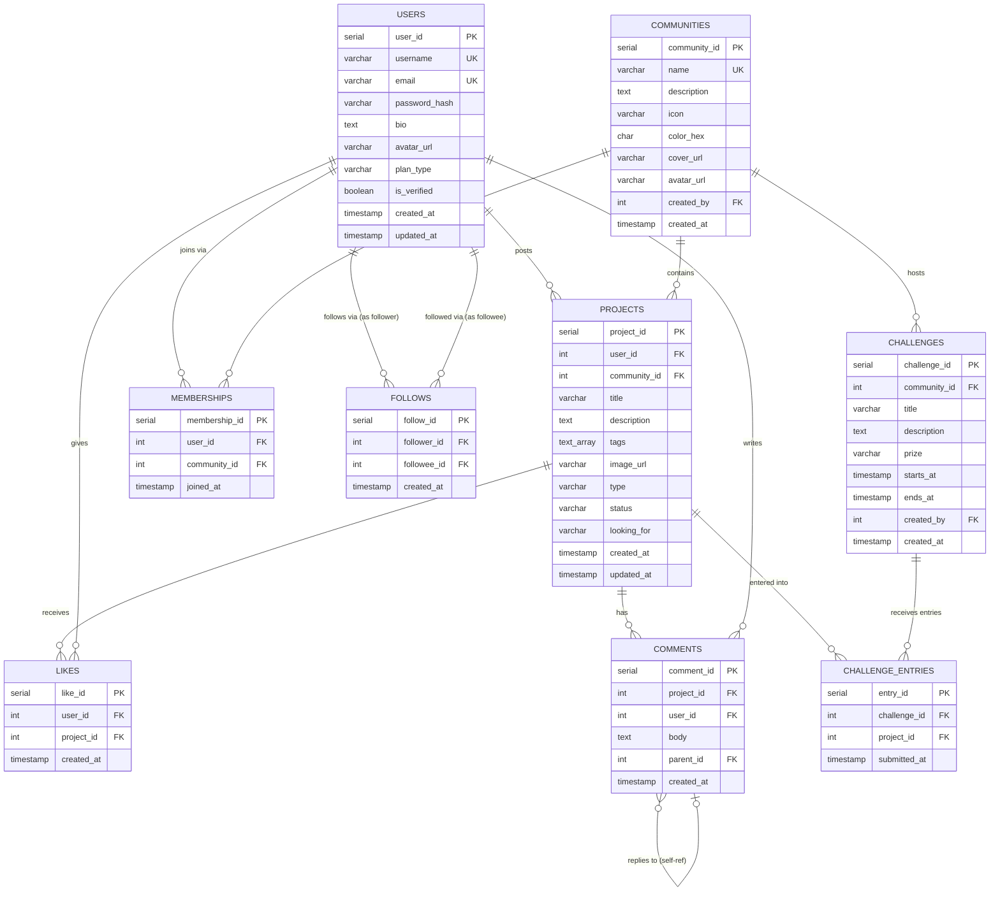

# HobbyHub — Database Design Document

**Product:** HobbyHub — Social Platform for Hobby & Project Sharing
**Classes:** FESE304 (Database Management System) & FESE305 (Software App Dev Studio)
**Databases:** PostgreSQL (Relational) + MongoDB (Document Store) + Redis (Cache)
**Date:** March 2026

> **Ground Rule:** Every table in this document appears in the ERD diagram AND in at least one SQL query. Every query is explained line-by-line in plain English.

---

## Grading Map for This Document

| Graded Section | Points | Where to Find It |
|---|---|---|
| **4. Data Modeling & DB Design** | 20 pts (FESE304 + FESE305) | Section 1 (ERD Narrative), Section 2 (EER Diagram), Section 3 (Normalization) |
| **5. DB Implementation & Optimization** | 20 pts (FESE304) | Section 4 (SQL Queries), Section 5 (NoSQL), Section 6 (Performance) |

---

## SECTION 1 — ERD Narrative: Every Entity Explained *(FESE304)*

Before we show any diagrams or code, here is a plain-English description of every table in the database, what it represents, and how it connects to everything else.

---

### Entity 1: USERS
**What it represents:** A person who has created an account on HobbyHub. Every user has a profile, which includes their name, a short bio, their skills, and whether they are on a free or premium plan.

**Cardinality with other entities:**
- One USER can post many PROJECTS, but each PROJECT belongs to exactly one USER.
- One USER can join many COMMUNITIES, and each COMMUNITY can have many USERS (linked through the MEMBERSHIPS table).
- One USER can like many PROJECTS, and each PROJECT can be liked by many USERS (linked through the LIKES table).
- One USER can write many COMMENTS, and each COMMENT belongs to exactly one USER.
- One USER can follow many other USERS, and be followed by many others (self-referencing, linked through the FOLLOWS table).

| Column Name | Data Type | Constraints | Plain-English Note |
|---|---|---|---|
| `user_id` | `SERIAL` | PRIMARY KEY | Auto-incremented number that uniquely identifies every user. |
| `username` | `VARCHAR(50)` | UNIQUE, NOT NULL | The user's display name. Must be unique — no two users can share the same handle. |
| `email` | `VARCHAR(255)` | UNIQUE, NOT NULL | Used for login. Must be unique and cannot be left blank. |
| `password_hash` | `VARCHAR(255)` | NOT NULL | The scrambled (hashed) version of the user's password. The real password is NEVER stored. |
| `bio` | `TEXT` | nullable | Optional short description the user writes about themselves. |
| `avatar_url` | `VARCHAR(500)` | nullable | URL of the user's profile photo. In the MVP, we use initials instead. |
| `plan_type` | `VARCHAR(10)` | DEFAULT 'free', CHECK IN ('free','premium') | Whether the user is on the free or premium plan. Defaults to 'free' for all new accounts. |
| `is_verified` | `BOOLEAN` | DEFAULT FALSE | TRUE if the user has been verified (usually tied to premium status). |
| `created_at` | `TIMESTAMP` | DEFAULT NOW() | The date and time the account was created. Set automatically by the database. |
| `updated_at` | `TIMESTAMP` | DEFAULT NOW() | The date and time the profile was last changed. |

---

### Entity 2: COMMUNITIES
**What it represents:** A hobby group on HobbyHub (e.g., "Code & Create," "Art Studio," "Music Lab"). Communities are the social containers that organize content. All projects belong to a community.

**Cardinality:**
- One COMMUNITY can have many USERS as members (via MEMBERSHIPS).
- One COMMUNITY can contain many PROJECTS.
- One COMMUNITY can host many CHALLENGES.

| Column Name | Data Type | Constraints | Plain-English Note |
|---|---|---|---|
| `community_id` | `SERIAL` | PRIMARY KEY | Unique identifier for the community. |
| `name` | `VARCHAR(100)` | UNIQUE, NOT NULL | The name of the community, e.g., "Music Lab." Must be unique. |
| `description` | `TEXT` | nullable | A short description of what this community is about. |
| `icon` | `VARCHAR(10)` | nullable | An emoji icon for the community (e.g., 🎵). |
| `color_hex` | `CHAR(7)` | nullable | A brand color for the community in hex format (e.g., `#7c6df5`). |
| `cover_url` | `VARCHAR(500)` | nullable | URL for the community's cover photo (the large banner image). |
| `avatar_url` | `VARCHAR(500)` | nullable | URL for the community's small circular logo. |
| `created_by` | `INT` | FOREIGN KEY → users.user_id, ON DELETE SET NULL | The user who created this community. If they delete their account, the community remains (set to NULL). |
| `created_at` | `TIMESTAMP` | DEFAULT NOW() | When the community was created. |

---

### Entity 3: PROJECTS
**What it represents:** A project post shared by a user. This is the core content of HobbyHub — what users share, browse, and engage with. It can be a startup idea, an art piece, a music track, or a game prototype.

**Cardinality:**
- Each PROJECT belongs to exactly one USER (the creator).
- Each PROJECT belongs to exactly one COMMUNITY.
- One PROJECT can receive many LIKES.
- One PROJECT can receive many COMMENTS.
- One PROJECT can appear in many CHALLENGE_ENTRIES (submitted to multiple challenges).

| Column Name | Data Type | Constraints | Plain-English Note |
|---|---|---|---|
| `project_id` | `SERIAL` | PRIMARY KEY | Unique identifier for the project. |
| `user_id` | `INT` | FK → users, NOT NULL, ON DELETE CASCADE | Who posted this project. If the user deletes their account, their projects are also deleted. |
| `community_id` | `INT` | FK → communities, ON DELETE SET NULL | Which community this project belongs to. If community is deleted, the project stays but loses its community link. |
| `title` | `VARCHAR(200)` | NOT NULL | The project's headline. Short and descriptive. |
| `description` | `TEXT` | NOT NULL | The longer explanation of what the project is about. |
| `tags` | `TEXT[]` | nullable | An array of tags, e.g., `{'React', 'AI', 'Education'}`. [INTENTIONAL DENORMALIZATION — see Section 3D] |
| `image_url` | `VARCHAR(500)` | nullable | URL of the project's cover image. Stored in AWS S3 in production. |
| `type` | `VARCHAR(20)` | CHECK IN ('showcase','startup'), DEFAULT 'showcase' | Whether this is a casual "showcase" project or a serious "startup" idea. |
| `status` | `VARCHAR(20)` | CHECK IN ('draft','published','featured','archived'), DEFAULT 'draft' | The current state of the project in its lifecycle. |
| `looking_for` | `VARCHAR(200)` | nullable | What kind of collaborator the creator is seeking, e.g., "UI/UX Designer." |
| `created_at` | `TIMESTAMP` | DEFAULT NOW() | When the project was posted. Used for feed ordering. |
| `updated_at` | `TIMESTAMP` | DEFAULT NOW() | When the project was last edited. |

---

### Entity 4: MEMBERSHIPS
**What it represents:** The link between a USER and a COMMUNITY. When a user "joins" a community, one row is added to this table. When they "leave," that row is deleted. This is a "junction table" (also called a "bridge table") — it exists only to connect two other tables in a many-to-many relationship.

**Cardinality:**
- Each MEMBERSHIP row links exactly one USER to exactly one COMMUNITY.

| Column Name | Data Type | Constraints | Plain-English Note |
|---|---|---|---|
| `membership_id` | `SERIAL` | PRIMARY KEY | Unique ID for this membership record. |
| `user_id` | `INT` | FK → users, NOT NULL, ON DELETE CASCADE | Which user joined. If user is deleted, their memberships are also deleted. |
| `community_id` | `INT` | FK → communities, NOT NULL, ON DELETE CASCADE | Which community was joined. |
| `joined_at` | `TIMESTAMP` | DEFAULT NOW() | When the user joined. |
| — | — | `UNIQUE(user_id, community_id)` | A user can't join the same community twice. The database enforces this rule. |

---

### Entity 5: LIKES
**What it represents:** A "like" is a simple signal of approval from one user toward one project. The LIKES table tracks who liked what and ensures nobody likes the same project twice.

**Cardinality:**
- Each LIKE belongs to exactly one USER and exactly one PROJECT.

| Column Name | Data Type | Constraints | Plain-English Note |
|---|---|---|---|
| `like_id` | `SERIAL` | PRIMARY KEY | Unique ID for each like. |
| `user_id` | `INT` | FK → users, NOT NULL, ON DELETE CASCADE | Who gave the like. |
| `project_id` | `INT` | FK → projects, NOT NULL, ON DELETE CASCADE | Which project was liked. If the project is deleted, the like disappears too. |
| `created_at` | `TIMESTAMP` | DEFAULT NOW() | When the like was given. |
| — | — | `UNIQUE(user_id, project_id)` | One user = one like per project. The database blocks duplicate likes. |

---

### Entity 6: COMMENTS
**What it represents:** Text feedback left by a user on a project. Comments support threading — a reply to a comment is just a comment with a `parent_id` pointing to the original comment.

**Cardinality:**
- Each COMMENT belongs to exactly one PROJECT and exactly one USER.
- A COMMENT can optionally have a parent COMMENT (for threaded replies — one level deep).

| Column Name | Data Type | Constraints | Plain-English Note |
|---|---|---|---|
| `comment_id` | `SERIAL` | PRIMARY KEY | Unique ID for the comment. |
| `project_id` | `INT` | FK → projects, NOT NULL, ON DELETE CASCADE | Which project this comment is on. |
| `user_id` | `INT` | FK → users, NOT NULL, ON DELETE CASCADE | Who wrote the comment. |
| `body` | `TEXT` | NOT NULL | The text content of the comment. Cannot be empty. |
| `parent_id` | `INT` | FK → comments(comment_id), nullable, ON DELETE CASCADE | If this is a reply, this points to the original comment. If it's a top-level comment, this is NULL. |
| `created_at` | `TIMESTAMP` | DEFAULT NOW() | When the comment was posted. |

---

### Entity 7: FOLLOWS
**What it represents:** A one-way follow relationship between two users. If Alex follows Mia, Alex sees Mia's new projects in his home feed. This is a "self-referencing" relationship — the USERS table references itself.

**Cardinality:**
- One USER (the follower) can follow many other USERS.
- One USER can be followed by many other USERS.

| Column Name | Data Type | Constraints | Plain-English Note |
|---|---|---|---|
| `follow_id` | `SERIAL` | PRIMARY KEY | Unique ID for this follow relationship. |
| `follower_id` | `INT` | FK → users, NOT NULL, ON DELETE CASCADE | The user who is doing the following (e.g., Alex). |
| `followee_id` | `INT` | FK → users, NOT NULL, ON DELETE CASCADE | The user who is being followed (e.g., Mia). |
| `created_at` | `TIMESTAMP` | DEFAULT NOW() | When this follow relationship started. |
| — | — | `UNIQUE(follower_id, followee_id)` | You can't follow the same person twice. |
| — | — | `CHECK (follower_id != followee_id)` | You can't follow yourself. |

---

### Entity 8: CHALLENGES
**What it represents:** A time-limited creative competition hosted inside a community. Each challenge has a start date, an end date, a prize, and many project entries.

**Cardinality:**
- One CHALLENGE belongs to exactly one COMMUNITY.
- One CHALLENGE can receive many CHALLENGE_ENTRIES.

| Column Name | Data Type | Constraints | Plain-English Note |
|---|---|---|---|
| `challenge_id` | `SERIAL` | PRIMARY KEY | Unique ID for the challenge. |
| `community_id` | `INT` | FK → communities, NOT NULL, ON DELETE CASCADE | Which community is hosting this challenge. |
| `title` | `VARCHAR(200)` | NOT NULL | The challenge's name (e.g., "Build a Mini App in 48hrs"). |
| `description` | `TEXT` | nullable | Details about what participants need to do. |
| `prize` | `VARCHAR(200)` | nullable | What the winner receives (e.g., "Featured Badge + 3 months Premium"). |
| `starts_at` | `TIMESTAMP` | NOT NULL | When the challenge opens for entry submissions. |
| `ends_at` | `TIMESTAMP` | NOT NULL | The deadline. After this time, no more entries are accepted. |
| `created_by` | `INT` | FK → users, ON DELETE SET NULL | The admin user who created the challenge. |
| `created_at` | `TIMESTAMP` | DEFAULT NOW() | When the challenge was set up. |

---

### Entity 9: CHALLENGE_ENTRIES
**What it represents:** A link between a PROJECT and a CHALLENGE. When a user enters their project into a challenge, one row is created here. The leaderboard is built by counting likes on the linked projects.

**Cardinality:**
- Each CHALLENGE_ENTRY links exactly one PROJECT to exactly one CHALLENGE.
- One CHALLENGE can have many CHALLENGE_ENTRIES (many projects entering).
- One PROJECT can be entered in multiple CHALLENGES.

| Column Name | Data Type | Constraints | Plain-English Note |
|---|---|---|---|
| `entry_id` | `SERIAL` | PRIMARY KEY | Unique ID for this challenge entry. |
| `challenge_id` | `INT` | FK → challenges, NOT NULL, ON DELETE CASCADE | Which challenge this is an entry for. |
| `project_id` | `INT` | FK → projects, NOT NULL, ON DELETE CASCADE | Which project was submitted. |
| `submitted_at` | `TIMESTAMP` | DEFAULT NOW() | When the entry was submitted. |
| — | — | `UNIQUE(challenge_id, project_id)` | You can't submit the same project to the same challenge twice. |

---

## SECTION 2 — EER Diagram (Entity-Relationship Diagram)

This diagram shows all tables and how they connect. Arrows show foreign key relationships (one table pointing to another).



---

## SECTION 3 — Normalization Walkthrough *(FESE304)*

**What is normalization?** Normalization is the process of organizing a database to remove redundant (repeated) data and reduce the chance of errors. We go through three steps called "Normal Forms" (1NF, 2NF, 3NF).

We will use a real example from HobbyHub: **storing user project data.**

---

### Step A: Unnormalized Form (UNF) — The Messy Starting Point

Imagine if we stored everything in a single messy spreadsheet. This is what the data looks like BEFORE normalization:

| user_id | username | email | project_title1 | project_tags1 | project_community1 | project_title2 | project_tags2 | project_community2 |
|---|---|---|---|---|---|---|---|---|
| 1 | alex_chen | alex@hub.com | StudyBuddy App | React, AI | Code & Create | Campus Finder | Firebase, Events | Code & Create |
| 2 | mia_torres | mia@hub.com | Campus Illustrations | Digital Art, Print | Art Studio | NULL | NULL | NULL |

**What's wrong here?** This has "repeating groups" — we have `project_title1`, `project_title2`, `project_title3`... and we don't know how many columns to add. If a user has 50 projects, we need 50 column sets. This breaks the first rule of good database design.

---

### Step B: First Normal Form (1NF) — No Repeating Groups

**The Rule:** Every column must hold only ONE value. No lists within a cell. No repeated column groups.

**The Fix:** We split projects into their own rows.

**USERS after 1NF:**
| user_id | username | email |
|---|---|---|
| 1 | alex_chen | alex@hub.com |
| 2 | mia_torres | mia@hub.com |

**PROJECTS after 1NF:**
| project_id | user_id | project_title | project_community |
|---|---|---|---|
| 101 | 1 | StudyBuddy App | Code & Create |
| 102 | 1 | Campus Finder | Code & Create |
| 103 | 2 | Campus Illustrations | Art Studio |

**What changed?** Each project now has its own row. No more `project_title1`, `project_title2`. Now we can add unlimited projects without changing the table structure.

---

### Step C: Second Normal Form (2NF) — No Partial Dependencies

**The Rule:** Every non-key column must depend on the WHOLE primary key, not just part of it.

**The Problem (in this stage):** In the PROJECTS table above, `project_community` is a community name (a text string like "Code & Create"). If we also stored community details here, like `community_description` or `community_color`, those facts are about the community — NOT about the project. They partially depend on the community, not on the full primary key (`project_id`).

**The Fix:** Move community data to its own table. Use a foreign key (`community_id`) to link them.

**COMMUNITIES table (new):**
| community_id | name | description | color_hex |
|---|---|---|---|
| 1 | Code & Create | A hub for developers... | #3b82f6 |
| 2 | Art Studio | For illustrators... | #ec4899 |

**PROJECTS table after 2NF:**
| project_id | user_id | community_id | project_title |
|---|---|---|---|
| 101 | 1 | 1 | StudyBuddy App |
| 102 | 1 | 1 | Campus Finder |
| 103 | 2 | 2 | Campus Illustrations |

**What changed?** The community name "Code & Create" is no longer stored in the projects table. Instead, we just store the number `1` (the community ID) and look up the details from the COMMUNITIES table. If "Code & Create" changes its name, we only update ONE row in COMMUNITIES — not every project that belonged to it.

---

### Step D: Third Normal Form (3NF) — No Transitive Dependencies

**The Rule:** Non-key columns must depend ONLY on the primary key — not on other non-key columns.

**The Problem (in this stage):** Imagine if we stored `plan_type` AND `monthly_price` on the USERS table:
| user_id | username | plan_type | monthly_price |
|---|---|---|---|
| 1 | alex_chen | premium | $5 |
| 2 | mia_torres | free | $0 |

Here, `monthly_price` does not depend on `user_id` (the primary key). It depends on `plan_type`. This is a "transitive dependency" — `user_id → plan_type → monthly_price`. If we change the price of the premium plan from $5 to $7, we'd have to update EVERY premium user's row. That's a major data integrity risk.

**The Fix:** Move pricing to a separate PLANS table.

**PLANS table (new — for future use):**
| plan_key | monthly_price | max_communities |
|---|---|---|
| free | $0 | 3 |
| premium | $5 | unlimited |

**USERS table after 3NF:**
| user_id | username | email | plan_type |
|---|---|---|---|
| 1 | alex_chen | alex@hub.com | premium |
| 2 | mia_torres | mia@hub.com | free |

**What changed?** `monthly_price` is gone from USERS. Now if the premium price changes, we update ONE row in PLANS, and it's automatically correct for every user on that plan.

---

### Step E: Intentional Denormalization — The `tags` Array

The fully normalized version of tags would be a separate `project_tags` junction table:

```sql
-- ❌ Fully Normalized (technically correct, but slow for our use case):
CREATE TABLE project_tags (
  project_id INT REFERENCES projects(project_id),
  tag        VARCHAR(50),
  PRIMARY KEY (project_id, tag)
);
-- Fetching any project now requires a JOIN on this table EVERY time.
```

**The problem:** The home feed loads 20+ project cards at once. Every card needs its tags. A JOIN to a separate `project_tags` table means 20+ extra DB reads per page load. This is slow.

**Our decision:** Store tags as a PostgreSQL native `TEXT[]` array directly in the projects table.

```sql
-- ✅ Denormalized (faster for reads, which dominate our workload):
SELECT project_id, title, tags FROM projects WHERE project_id = 101;
-- Result: tags = {'React', 'AI', 'Education'}
-- Single query, no JOIN needed.
```

**Trade-off:** Updating or searching within tags is slightly more complex. We use PostgreSQL's `GIN` index on the array for fast `@>` (contains) searches. Projects are read ~100x more often than their tags are changed. The performance win on reads outweighs the complexity on writes.

**Feasibility & Next Steps:** The 3NF schema described above is what the `02_DATABASE_DESIGN_DOCUMENT.md` implements with its `CREATE TABLE` statements. The next step for the DB team is to run all `CREATE TABLE` and `CREATE INDEX` scripts on the development PostgreSQL instance.

---

## SECTION 4 — SQL Query Portfolio *(FESE304)*

All 8 queries below use real HobbyHub business logic. Each is explained line by line.

---

### Query 1: Home Feed — Top Projects with Full Stats (Multi-Table JOIN + GROUP BY)

**Business Purpose:** Build the home feed. For each published project, we need the post's details, the creator's info, the community name, the total likes, and the total comments — all in one efficient query.

```sql
-- Query 1: Get the top 20 most-liked published projects for the home feed.
-- This runs every time a user loads their home page.

SELECT
  p.project_id,                        -- The project's unique ID
  p.title,                             -- The project's headline
  p.description,                       -- The project's full description
  p.tags,                              -- Array of tags (e.g., {React, AI})
  p.type,                              -- 'showcase' or 'startup'
  p.looking_for,                       -- What collaborator they want, if any
  p.created_at,                        -- When it was posted (for "2 days ago" display)
  u.user_id,                           -- Creator's ID
  u.username,                          -- Creator's display name
  u.avatar_url,                        -- Creator's profile photo
  u.plan_type,                         -- 'free' or 'premium' (for badge display)
  c.community_id,
  c.name        AS community_name,     -- The community this project belongs to
  c.icon        AS community_icon,     -- Emoji icon for the community
  COUNT(DISTINCT l.like_id)   AS total_likes,    -- Total number of likes
  COUNT(DISTINCT cm.comment_id) AS total_comments -- Total number of comments
FROM projects p
  INNER JOIN users u        ON p.user_id = u.user_id         -- Must have a valid creator
  INNER JOIN communities c  ON p.community_id = c.community_id -- Must belong to a community
  LEFT JOIN  likes l        ON p.project_id = l.project_id   -- Count likes (0 if none)
  LEFT JOIN  comments cm    ON p.project_id = cm.project_id  -- Count comments (0 if none)
WHERE p.status = 'published'                   -- Only show live projects, not drafts
GROUP BY p.project_id, u.user_id, c.community_id -- Group to aggregate likes + comments
ORDER BY total_likes DESC, p.created_at DESC  -- Most liked first, newest as tiebreaker
LIMIT 20;                                      -- Only the top 20 projects
```

**Why INNER JOIN for users and communities?** Because a project without a valid creator or community is broken data — we don't want to show it.

**Why LEFT JOIN for likes and comments?** A new project has zero likes and zero comments. A LEFT JOIN returns 0 instead of omitting the project entirely from the results.

**Performance:** This query's result is cached in Redis with a 2-minute TTL (Time-To-Live — meaning the cache expires after 2 minutes and the query runs again to get fresh data).

---

### Query 2: Find Suggested Collaborators (Correlated Subquery + NOT IN + ARRAY_AGG)

**Business Purpose:** Power the "People You May Know" feature on the Directory page. Find users who are in the same communities as me, but whom I'm not yet following.

```sql
-- Query 2: Find up to 10 suggested collaborators for user with ID = $1 (current user).
-- Shows people in shared communities who I don't already follow.

SELECT
  u.user_id,
  u.username,
  u.avatar_url,
  u.bio,
  u.plan_type,
  ARRAY_AGG(DISTINCT c.name) AS shared_communities, -- Lists all communities we share
  COUNT(DISTINCT m.community_id) AS common_count    -- How many communities in common
FROM users u
  INNER JOIN memberships m ON u.user_id = m.user_id           -- Get their communities
  INNER JOIN communities c ON m.community_id = c.community_id -- Get community names
WHERE
  -- Only look at communities that I (the current user) have also joined
  m.community_id IN (
    SELECT community_id
    FROM   memberships
    WHERE  user_id = $1  -- $1 = current user's ID (parameterized to prevent SQL injection)
  )
  -- Exclude users I'm already following
  AND u.user_id NOT IN (
    SELECT followee_id
    FROM   follows
    WHERE  follower_id = $1
  )
  -- Exclude myself
  AND u.user_id != $1
GROUP BY u.user_id
ORDER BY common_count DESC  -- Show people with the MOST communities in common first
LIMIT 10;
```

**What is SQL injection?** SQL injection is a security attack where a hacker puts malicious code into an input field. By using `$1` (a parameterized query), we tell the database "this is just data, not a command," which makes the query safe.

**What does ARRAY_AGG do?** It collects multiple rows' values into a single array. If Alex and Mia share two communities ("Code & Create" and "Art Studio"), `ARRAY_AGG(DISTINCT c.name)` returns `{Code & Create, Art Studio}` as one value in a single row.

---

### Query 3: Challenge Leaderboard with Ranking (Window Function: RANK)

**Business Purpose:** Build the leaderboard for the Challenges page. Rank all challenge entries by like count. Show each entry's rank and the creator's details.

```sql
-- Query 3: Build the leaderboard for a specific challenge ($1 = challenge_id).
-- Uses RANK() window function to assign ranks based on like count.

SELECT
  ce.entry_id,
  p.project_id,
  p.title       AS project_title,
  u.user_id,
  u.username,
  u.avatar_url,
  u.plan_type,
  COUNT(l.like_id) AS vote_count,  -- Number of likes = number of "votes" in the contest

  -- RANK() assigns a position number based on vote_count.
  -- If two entries tie, both get the same rank (e.g., both rank #1).
  -- The next rank after a tie skips numbers (e.g., after two #1s, the next is #3).
  RANK() OVER (ORDER BY COUNT(l.like_id) DESC) AS leaderboard_rank,

  -- DENSE_RANK() is similar but does NOT skip numbers after a tie.
  -- After two #1s, the next entry is #2, not #3.
  DENSE_RANK() OVER (ORDER BY COUNT(l.like_id) DESC) AS dense_rank

FROM challenge_entries ce
  INNER JOIN projects p ON ce.project_id = p.project_id -- Get project details
  INNER JOIN users u    ON p.user_id = u.user_id        -- Get creator details
  LEFT JOIN  likes l    ON p.project_id = l.project_id  -- Count likes (votes)
WHERE ce.challenge_id = $1   -- Only entries for this specific challenge
GROUP BY ce.entry_id, p.project_id, u.user_id
ORDER BY leaderboard_rank;   -- Show #1 at the top
```

**What is a Window Function?** A normal `GROUP BY` collapses many rows into one summary row. A window function (`RANK()`, `DENSE_RANK()`, `ROW_NUMBER()`) calculates a value for each row WHILE still keeping all rows visible. It "looks through a window" at the surrounding rows to compute the rank.

This leaderboard result is also cached in Redis with a 30-second TTL because it updates frequently as users like entries.

---

### Query 4: Personalized Home Feed (UNION of Two Sources)

**Business Purpose:** Combine two types of content for the home feed: (1) projects from communities I've joined, and (2) projects from users I follow. Use UNION to merge them and remove duplicates (a project from a followed user who is also in my community should appear only once).

```sql
-- Query 4: Build the personalized feed for user $1.
-- Combines community content and followed-user content.

-- Part 1: Projects from communities I have joined
SELECT
  p.project_id,
  p.title,
  p.created_at,
  'community_feed'  AS feed_source -- Tells the UI where this project came from
FROM projects p
  INNER JOIN memberships m ON p.community_id = m.community_id
WHERE m.user_id   = $1             -- I am a member of this project's community
  AND p.status    = 'published'    -- Only show published projects

UNION  -- Combines results from both queries and removes duplicates

-- Part 2: Projects from users I follow
SELECT
  p.project_id,
  p.title,
  p.created_at,
  'following_feed'  AS feed_source
FROM projects p
  INNER JOIN follows f ON p.user_id = f.followee_id
WHERE f.follower_id = $1           -- I am following this project's creator
  AND p.status      = 'published'

ORDER BY created_at DESC           -- Newest projects first overall
LIMIT 40;                          -- Max 40 items on a page
```

**Why UNION and not UNION ALL?** `UNION ALL` would keep duplicate rows (if a project appears in both results because the creator is in my community AND I follow them, it would appear twice in the feed). `UNION` automatically removes exact duplicates. For a feed, showing the same post twice would be annoying.

---

### Query 5: User Activity Summary (Aggregation with GROUP BY + HAVING)

**Business Purpose:** Find "power users" — users who have posted at least 3 projects and have received more than 50 total likes. Used by the admin for the "Showcase of the Week" selection and for the premium conversion campaign.

```sql
-- Query 5: Find power users with at least 3 projects and 50+ total likes.
-- Used for the 'Showcase of the Week' admin selection tool.

SELECT
  u.user_id,
  u.username,
  u.plan_type,
  COUNT(DISTINCT p.project_id)  AS total_projects,  -- How many projects they've posted
  SUM(
    (SELECT COUNT(*) FROM likes l WHERE l.project_id = p.project_id)
  ) AS total_likes_received,                        -- Total likes across ALL their projects
  MAX(p.created_at) AS last_active                  -- When they last posted something
FROM users u
  INNER JOIN projects p ON u.user_id = p.user_id
WHERE p.status = 'published'
GROUP BY u.user_id, u.username, u.plan_type
HAVING
  COUNT(DISTINCT p.project_id) >= 3  -- Must have at least 3 projects
  AND SUM(
    (SELECT COUNT(*) FROM likes l WHERE l.project_id = p.project_id)
  ) >= 50                             -- Must have received at least 50 likes total
ORDER BY total_likes_received DESC;
```

**What is HAVING?** `WHERE` filters individual rows before grouping. `HAVING` filters groups AFTER the `GROUP BY` has run. We need `HAVING` here because we are filtering on `COUNT(projects)`, which is a group calculation.

---

### Query 6: Comment Thread Retrieval (CTE — Common Table Expression)

**Business Purpose:** Load all top-level comments for a project, and for each comment, load its replies — all in one query. This powers the comment section on the Project Detail page.

```sql
-- Query 6: Get all comments + replies for project $1, using a recursive CTE.
-- A CTE (Common Table Expression) is a named temporary result used within the query.

WITH RECURSIVE comment_tree AS (
  -- BASE CASE: Get all TOP-LEVEL comments (no parent)
  SELECT
    comment_id,
    user_id,
    body,
    parent_id,
    created_at,
    0  AS depth          -- Depth 0 = top level comment
  FROM comments
  WHERE project_id = $1  -- Only for this specific project
    AND parent_id IS NULL -- Only top-level comments

  UNION ALL

  -- RECURSIVE CASE: For each comment found above, find its replies
  SELECT
    c.comment_id,
    c.user_id,
    c.body,
    c.parent_id,
    c.created_at,
    ct.depth + 1  AS depth  -- Mark child comments as depth 1
  FROM comments c
    INNER JOIN comment_tree ct ON c.parent_id = ct.comment_id
  WHERE ct.depth < 2  -- Limit to 2 levels of nesting (replies to replies)
)

-- Now join the comment tree with the users table to get commenter names
SELECT
  ct.comment_id,
  ct.body,
  ct.parent_id,
  ct.created_at,
  ct.depth,
  u.user_id,
  u.username,
  u.avatar_url
FROM comment_tree ct
  INNER JOIN users u ON ct.user_id = u.user_id
ORDER BY
  COALESCE(ct.parent_id, ct.comment_id),  -- Group replies under their parent
  ct.created_at ASC;                       -- Oldest comments first
```

**What is a CTE?** A CTE (Common Table Expression) is like creating a temporary named table just for this query. We write `WITH comment_tree AS (...)` to define it, then use `comment_tree` in the main SELECT below. The `RECURSIVE` keyword allows the CTE to reference itself — this is how we get replies of replies.

---

### Query 7: Full-Text Project Search (Indexed Lookup Performance Query)

**Business Purpose:** Power the search bar on the Projects page. When a user types "React AI", return projects whose title or description contains those words. Uses PostgreSQL's built-in full-text search, which is much faster than a simple `LIKE '%react%'`.

```sql
-- Query 7: Full-text search for projects matching the user's query string $1.
-- E.g., $1 = 'react ai education'

-- First, create these indexes (run once during DB setup, NOT on every query):
-- CREATE INDEX idx_projects_fts ON projects
--   USING GIN (to_tsvector('english', title || ' ' || description));

-- The search query itself:
SELECT
  p.project_id,
  p.title,
  p.description,
  p.tags,
  p.type,
  u.username,
  c.name AS community_name,
  COUNT(DISTINCT l.like_id) AS total_likes,

  -- ts_rank gives a score from 0-1 showing how well the project matches the search query
  ts_rank(
    to_tsvector('english', p.title || ' ' || p.description),
    plainto_tsquery('english', $1)
  ) AS relevance_score

FROM projects p
  INNER JOIN users u       ON p.user_id = u.user_id
  INNER JOIN communities c ON p.community_id = c.community_id
  LEFT JOIN  likes l       ON p.project_id = l.project_id
WHERE
  p.status = 'published'
  AND to_tsvector('english', p.title || ' ' || p.description)
      @@ plainto_tsquery('english', $1)   -- @@ means "matches the search query"
GROUP BY p.project_id, u.user_id, c.community_id
ORDER BY relevance_score DESC, total_likes DESC -- Most relevant + most liked first
LIMIT 20;
```

**Performance comparison:**
- `LIKE '%react%'` → scans every row in the table. Very slow on large datasets. O(n).
- `to_tsvector @@ plainto_tsquery` with a GIN index → uses an index. Very fast. O(log n).
- On a table with 1 million projects, `LIKE` might take 2+ seconds. Full-text search takes under 50ms.

---

### Query 8: KPI Dashboard Query — Weekly Project Engagement (Supports KPI-3)

**Business Purpose:** This query powers the admin KPI dashboard. It calculates the weekly engagement rate (total likes + comments per active user) to measure whether HobbyHub is meeting its KPI-3 target of ≥ 50%.

```sql
-- Query 8: Calculate weekly engagement rate per community for the past 4 weeks.
-- Used to track KPI-3: Engagement Rate = (Likes + Comments) / Active Users x 100

WITH weekly_stats AS (
  -- Collect all engagement events (likes and comments) from the last 4 weeks
  SELECT
    DATE_TRUNC('week', l.created_at) AS week_start,  -- Round down to the start of the week
    p.community_id,
    COUNT(l.like_id) AS likes_count                  -- Number of likes this week
  FROM likes l
    INNER JOIN projects p ON l.project_id = p.project_id
  WHERE l.created_at >= NOW() - INTERVAL '4 weeks'
  GROUP BY DATE_TRUNC('week', l.created_at), p.community_id

),
weekly_comments AS (
  SELECT
    DATE_TRUNC('week', cm.created_at) AS week_start,
    p.community_id,
    COUNT(cm.comment_id) AS comments_count
  FROM comments cm
    INNER JOIN projects p ON cm.project_id = p.project_id
  WHERE cm.created_at >= NOW() - INTERVAL '4 weeks'
  GROUP BY DATE_TRUNC('week', cm.created_at), p.community_id
),
active_users_weekly AS (
  -- Count unique users who took any action (liked or commented) each week
  SELECT
    DATE_TRUNC('week', created_at) AS week_start,
    COUNT(DISTINCT user_id)        AS active_users
  FROM likes
  WHERE created_at >= NOW() - INTERVAL '4 weeks'
  GROUP BY DATE_TRUNC('week', created_at)
)

SELECT
  ws.week_start,
  c.name AS community_name,
  COALESCE(ws.likes_count, 0)        AS total_likes,
  COALESCE(wc.comments_count, 0)     AS total_comments,
  au.active_users,
  -- Calculate the engagement rate: (likes + comments) / active_users * 100
  ROUND(
    (COALESCE(ws.likes_count, 0) + COALESCE(wc.comments_count, 0))::NUMERIC
    / NULLIF(au.active_users, 0) * 100,
    2
  ) AS engagement_rate_pct
FROM weekly_stats ws
  INNER JOIN communities c ON ws.community_id = c.community_id
  LEFT JOIN  weekly_comments wc
    ON ws.week_start = wc.week_start AND ws.community_id = wc.community_id
  LEFT JOIN  active_users_weekly au ON ws.week_start = au.week_start
ORDER BY ws.week_start DESC, engagement_rate_pct DESC;
```

**What does `NULLIF(au.active_users, 0)` do?** It prevents dividing by zero. If there are 0 active users in a week, dividing by zero would cause a database error. `NULLIF(value, 0)` returns NULL instead of 0, and dividing by NULL safely returns NULL.

---

## SECTION 5 — NoSQL Strategy: MongoDB + Redis *(FESE304)*

---

### 5A: MongoDB — Why We Use It for Notifications

**The problem PostgreSQL alone cannot solve here:**

Notifications in HobbyHub come in many different "shapes." A "like" notification needs to store the liker's name and the project title. A "challenge result" notification needs the challenge name and rank. A "follow" notification just needs the follower's name. In PostgreSQL (a relational database), we'd have to either create multiple separate notification tables (one per type), or have a single table with many nullable columns (most columns would be empty most of the time). Both options are messy and hard to maintain.

MongoDB stores each notification as a "document" (a JSON-like object), and each document can have different fields. This is exactly right for notifications.

**Sample MongoDB Notification Document:**

```json
// Like notification
{
  "_id": "507f1f77bcf86cd799439011",
  "user_id": 1,
  "type": "new_like",
  "read": false,
  "created_at": "2026-03-09T10:30:00Z",
  "payload": {
    "actor_id": 2,
    "actor_username": "mia_torres",
    "actor_avatar_url": "https://cdn.hobbyhub.com/avatars/mia.jpg",
    "project_id": 101,
    "project_title": "StudyBuddy App"
  }
}
```

```json
// Challenge result notification (completely different structure — no project_id needed)
{
  "_id": "507f191e810c19729de860ea",
  "user_id": 3,
  "type": "challenge_result",
  "read": false,
  "created_at": "2026-03-09T12:00:00Z",
  "payload": {
    "challenge_id": 1,
    "challenge_title": "Build a Mini App in 48hrs",
    "final_rank": 1,
    "total_entries": 67,
    "prize": "Featured Badge + 3 months Premium"
  }
}
```

**Why each field exists:**
- `_id`: MongoDB's automatic unique identifier (like a primary key).
- `user_id`: The user who should receive this notification.
- `type`: What kind of notification this is (like, comment, follow, challenge_result, showcase).
- `read`: Boolean (true/false) — whether the user has seen this notification. Used for the unread count badge on the bell icon.
- `created_at`: When the notification was generated. Used for sorting ("2 min ago").
- `payload`: The flexible part. Different types have completely different fields here.

**MongoDB Indexes:**
```javascript
// Index 1: Find all unread notifications for a user, sorted by newest first
db.notifications.createIndex({ user_id: 1, created_at: -1 });

// Index 2: Find unread notifications specifically (for badge count)
db.notifications.createIndex({ user_id: 1, read: 1 });
```

**NoSQL Risk & Mitigation Table:**

| Risk | Likelihood | Impact | Mitigation |
|---|---|---|---|
| Notifications become out of sync with PostgreSQL data (e.g., project is deleted but notification still references it) | Medium | Low | Reference check on read: if `project_id` in payload points to a deleted project, show "This project was deleted" gracefully. |
| MongoDB goes down and users can't see notifications | Low | Medium | Notifications are non-critical (app still works without them); add a TTL index to auto-delete notifications older than 90 days to keep the collection small. |
| Inconsistent notification format bugs | Medium | Medium | Validate all notification documents against a JSON schema before inserting. |

---

### 5B: Redis — Caching Strategy

**Why Redis?** Redis is an "in-memory" database — it stores data in RAM (Random Access Memory) rather than on a hard disk. Accessing RAM is roughly 100,000× faster than accessing a hard disk. For data that many users request repeatedly (the home feed, the challenge leaderboard), Redis dramatically reduces the load on PostgreSQL.

| What We Cache | Redis Key Pattern | TTL | What Happens on Cache Miss |
|---|---|---|---|
| Home Feed | `feed:user:{user_id}` | 2 minutes | Runs Query 1 (JOIN query), stores result, returns it |
| Challenge Leaderboard | `challenge:board:{challenge_id}` | 30 seconds | Runs Query 3 (RANK query), stores result, returns it |
| Community Member Count | `community:count:{community_id}` | 10 minutes | Runs `SELECT COUNT(*) FROM memberships WHERE community_id = X` |
| User Profile | `user:profile:{user_id}` | 5 minutes | Runs `SELECT * FROM users WHERE user_id = X` |
| JWT Session | `session:{user_id}` | 7 days | User must log in again |
| Rate Limiting | `ratelimit:{user_id}:{endpoint}` | 60 seconds | Counter starts at 0 for the new window |

**Example: Feed Cache Flow**
```
User opens Home page
    → React app sends: GET /feed/1
    → API checks Redis: GET "feed:user:1"
    → Key exists in Redis? (Cache HIT)
        → Return cached JSON to app immediately (< 5ms)
    → Key does NOT exist? (Cache MISS)
        → Run Query 1 on PostgreSQL (complex JOIN, ~150ms)
        → Store result in Redis: SET "feed:user:1" <json> EX 120
        → Return JSON to app (~155ms)
```

**When is the cache cleared (cache invalidation)?**
- A user posts a new project → `DEL feed:user:{user_id}`
- A user likes a project → `DEL challenge:board:{challenge_id}` (if the project is a challenge entry) and the cached feed is left to expire naturally
- A community gets a new member → `DEL community:count:{community_id}`

---

## SECTION 6 — Performance Plan *(FESE304)*

---

### 6A. Full Indexing Plan

*(An index is like a book's index — instead of reading every page to find a word, you go straight to the right page. Database indexes work the same way, making queries much faster.)*

```sql
-- ==============================================================
-- USERS TABLE INDEXES
-- ==============================================================
CREATE INDEX idx_users_email    ON users(email);
CREATE INDEX idx_users_username ON users(username);
-- Reason: Login checks email; search checks username.
-- Without indexes, every login would scan ALL user records.

-- ==============================================================
-- PROJECTS TABLE INDEXES
-- ==============================================================
-- Partial index: Only index PUBLISHED projects (ignores drafts/archived)
-- This keeps the index small and fast.
CREATE INDEX idx_projects_status
  ON projects(status)
  WHERE status = 'published';

CREATE INDEX idx_projects_user_id
  ON projects(user_id);
-- Reason: "Show all projects by user X" query runs on every profile page.

CREATE INDEX idx_projects_community_id
  ON projects(community_id);
-- Reason: "Show all projects in community X" runs on every community page.

CREATE INDEX idx_projects_created_at
  ON projects(created_at DESC);
-- Reason: Feed orders by newest first. DESC ensures the DB scans recent items first.

-- Full-text search index (GIN = Generalized Inverted Index — designed for array searches)
CREATE INDEX idx_projects_fts
  ON projects
  USING GIN (to_tsvector('english', title || ' ' || COALESCE(description, '')));
-- Reason: Powers Query 7 (full-text search). Makes search sub-50ms.

-- Tag search index
CREATE INDEX idx_projects_tags
  ON projects
  USING GIN (tags);
-- Reason: Allows fast "find all projects tagged React" queries.

-- ==============================================================
-- LIKES TABLE INDEXES
-- ==============================================================
CREATE UNIQUE INDEX idx_likes_user_project
  ON likes(user_id, project_id);
-- Reason: Enforces one-like-per-user AND makes "did this user like this project?" fast.

CREATE INDEX idx_likes_project_id
  ON likes(project_id);
-- Reason: Counting likes per project (used in every feed query).

-- ==============================================================
-- COMMENTS TABLE INDEXES
-- ==============================================================
CREATE INDEX idx_comments_project_id ON comments(project_id);
CREATE INDEX idx_comments_parent_id  ON comments(parent_id);
-- Reason: Loading comment threads requires fast lookups by project AND by parent comment.

-- ==============================================================
-- MEMBERSHIPS TABLE INDEXES
-- ==============================================================
CREATE UNIQUE INDEX idx_memberships_user_community
  ON memberships(user_id, community_id);
-- Reason: Prevents duplicate joins AND makes "is user X a member of community Y?" fast.

-- ==============================================================
-- FOLLOWS TABLE INDEXES
-- ==============================================================
CREATE INDEX idx_follows_follower_id ON follows(follower_id);
CREATE INDEX idx_follows_followee_id ON follows(followee_id);
-- Reason: "Get everyone I follow" and "get all my followers" both need these.

-- ==============================================================
-- CHALLENGES TABLE INDEXES
-- ==============================================================
CREATE INDEX idx_challenges_ends_at ON challenges(ends_at);
-- Reason: Finding active challenges requires checking which ones haven't expired yet.

CREATE INDEX idx_challenge_entries_challenge_id
  ON challenge_entries(challenge_id);
-- Reason: Building the leaderboard requires fetching all entries for a challenge fast.
```

---

### 6B. Query Optimization Decisions

| Technique | Decision | Plain-English Reason | Expected Benefit |
|---|---|---|---|
| **Redis Feed Cache** | Cache home feed for 2 minutes per user | The feed query is the most frequently run query. Caching 2 minutes means 1 DB query per user per 2 mins instead of 1 per page scroll. | Reduces DB load by ~70% |
| **Partial Index on Projects** | Only index `status = 'published'` projects | Draft and archived projects are rarely queried. An index on ALL projects is wasteful — 40% of rows in the table would never be sought. | Smaller, faster index |
| **Cursor-Based Pagination** | Use `WHERE created_at < $last_cursor` instead of `OFFSET` | `OFFSET 2000 LIMIT 20` makes the DB scan 2020 rows to skip the first 2000. Using a cursor (timestamp) jumps directly to the right position. | No slowdown at deeper pages |
| **Connection Pooling** | PgBouncer with pool size of 20 connections | Every API request needs a DB connection. Opening and closing thousands of connections per second is expensive. Pooling reuses them. | Supports 500+ concurrent API users |
| **Read Replicas** | Route all `SELECT` queries to a replica; only `INSERT/UPDATE/DELETE` hit the primary | The home feed is 100% reads. Adding a read replica doubles read capacity. | 2× throughput for read-heavy operations |
| **GIN Index for Tags** | `USING GIN(tags)` on the array column | Standard B-Tree indexes don't work on arrays. GIN (Generalized Inverted Index) is specifically designed for array and full-text columns. | Sub-10ms tag search on 1M projects |

---

### 6C. Query Performance Comparison

```sql
-- ❌ SLOW: LIKE search — scans every single row in the projects table
SELECT * FROM projects WHERE title LIKE '%react%';
-- On 100,000 rows: ~800ms. On 1,000,000 rows: several seconds.
-- This is called a "Sequential Scan" — the DB reads every row from top to bottom.

-- ✅ FAST: Full-text search — uses the GIN index to jump directly to matching rows
SELECT * FROM projects
WHERE to_tsvector('english', title) @@ plainto_tsquery('english', 'react');
-- On 100,000 rows: ~5ms. On 1,000,000 rows: ~20ms.
-- This is an "Index Scan" — the DB skips directly to matching rows.
```

```sql
-- ❌ SLOW: OFFSET pagination — scans and throws away rows
SELECT * FROM projects ORDER BY created_at DESC OFFSET 5000 LIMIT 20;
-- The DB must read 5020 rows to show you rows 5001-5020. Very slow on large tables.

-- ✅ FAST: Cursor pagination — jumps directly to the right position
SELECT * FROM projects
WHERE created_at < '2026-03-08T12:00:00'  -- $last_seen_timestamp from previous page
ORDER BY created_at DESC
LIMIT 20;
-- The DB uses the idx_projects_created_at index to find this timestamp instantly.
-- Speed is the same whether you are on page 1 or page 10,000.
```

---

### 6D. Database Scaling Plan

| Stage | Users | Recommended Config | Estimated Cost |
|---|---|---|---|
| **MVP (0–5K users)** | < 5K | Single AWS RDS db.t3.medium (2 vCPU, 4GB RAM) + Redis on ElastiCache t3.micro | ~$60/month |
| **Growth (5K–50K)** | 5K–50K | Upgrade to db.r5.large (2 vCPU, 16GB RAM) — more RAM = more data cached in PostgreSQL's internal buffer | ~$250/month |
| **Scale (50K–500K)** | 50K+ | Add one PostgreSQL read replica for all feed and search queries; writes stay on primary | ~$500/month |
| **Hyperscale (500K+)** | 500K+ | Horizontal sharding (split the users table by user_id range across multiple DB servers). This is a major engineering decision. | $2,000+/month |

**Feasibility & Next Steps:** For the MVP launch, a single AWS RDS instance is sufficient and cost-effective. The Redis caching strategy in Section 5B is already designed to reduce DB load, meaning the MVP can handle significantly more users than its raw DB capacity suggests. The immediate next step is to run `EXPLAIN ANALYZE` on Queries 1, 3, and 7 in the development environment to confirm that all expected indexes are being used (look for "Index Scan" in the output — avoid "Seq Scan" on large tables).

---

## SQL Schema: Complete CREATE TABLE Statements

These statements create the full HobbyHub database from scratch. Run them in order.

```sql
-- ============================================================
-- HobbyHub Database Schema — Run this file to create the DB
-- ============================================================

-- 1. Users (create first — everything else references this)
CREATE TABLE users (
  user_id       SERIAL PRIMARY KEY,
  username      VARCHAR(50)  UNIQUE NOT NULL,
  email         VARCHAR(255) UNIQUE NOT NULL,
  password_hash VARCHAR(255) NOT NULL,
  bio           TEXT,
  avatar_url    VARCHAR(500),
  plan_type     VARCHAR(10)  NOT NULL DEFAULT 'free'
                CHECK (plan_type IN ('free', 'premium')),
  is_verified   BOOLEAN NOT NULL DEFAULT FALSE,
  created_at    TIMESTAMP NOT NULL DEFAULT NOW(),
  updated_at    TIMESTAMP NOT NULL DEFAULT NOW()
);

-- 2. Communities
CREATE TABLE communities (
  community_id SERIAL PRIMARY KEY,
  name         VARCHAR(100) UNIQUE NOT NULL,
  description  TEXT,
  icon         VARCHAR(10),
  color_hex    CHAR(7),
  cover_url    VARCHAR(500),
  avatar_url   VARCHAR(500),
  created_by   INT REFERENCES users(user_id) ON DELETE SET NULL,
  created_at   TIMESTAMP NOT NULL DEFAULT NOW()
);

-- 3. Projects
CREATE TABLE projects (
  project_id   SERIAL PRIMARY KEY,
  user_id      INT NOT NULL REFERENCES users(user_id) ON DELETE CASCADE,
  community_id INT REFERENCES communities(community_id) ON DELETE SET NULL,
  title        VARCHAR(200) NOT NULL,
  description  TEXT NOT NULL,
  tags         TEXT[],
  image_url    VARCHAR(500),
  type         VARCHAR(20) NOT NULL DEFAULT 'showcase'
               CHECK (type IN ('showcase', 'startup')),
  status       VARCHAR(20) NOT NULL DEFAULT 'draft'
               CHECK (status IN ('draft','published','featured','archived')),
  looking_for  VARCHAR(200),
  created_at   TIMESTAMP NOT NULL DEFAULT NOW(),
  updated_at   TIMESTAMP NOT NULL DEFAULT NOW()
);

-- 4. Memberships (junction table: users ↔ communities)
CREATE TABLE memberships (
  membership_id SERIAL PRIMARY KEY,
  user_id       INT NOT NULL REFERENCES users(user_id) ON DELETE CASCADE,
  community_id  INT NOT NULL REFERENCES communities(community_id) ON DELETE CASCADE,
  joined_at     TIMESTAMP NOT NULL DEFAULT NOW(),
  UNIQUE(user_id, community_id)
);

-- 5. Likes
CREATE TABLE likes (
  like_id    SERIAL PRIMARY KEY,
  user_id    INT NOT NULL REFERENCES users(user_id) ON DELETE CASCADE,
  project_id INT NOT NULL REFERENCES projects(project_id) ON DELETE CASCADE,
  created_at TIMESTAMP NOT NULL DEFAULT NOW(),
  UNIQUE(user_id, project_id)
);

-- 6. Comments
CREATE TABLE comments (
  comment_id SERIAL PRIMARY KEY,
  project_id INT NOT NULL REFERENCES projects(project_id) ON DELETE CASCADE,
  user_id    INT NOT NULL REFERENCES users(user_id) ON DELETE CASCADE,
  body       TEXT NOT NULL,
  parent_id  INT REFERENCES comments(comment_id) ON DELETE CASCADE,
  created_at TIMESTAMP NOT NULL DEFAULT NOW()
);

-- 7. Follows (self-referencing)
CREATE TABLE follows (
  follow_id   SERIAL PRIMARY KEY,
  follower_id INT NOT NULL REFERENCES users(user_id) ON DELETE CASCADE,
  followee_id INT NOT NULL REFERENCES users(user_id) ON DELETE CASCADE,
  created_at  TIMESTAMP NOT NULL DEFAULT NOW(),
  UNIQUE(follower_id, followee_id),
  CHECK (follower_id != followee_id)
);

-- 8. Challenges
CREATE TABLE challenges (
  challenge_id SERIAL PRIMARY KEY,
  community_id INT NOT NULL REFERENCES communities(community_id) ON DELETE CASCADE,
  title        VARCHAR(200) NOT NULL,
  description  TEXT,
  prize        VARCHAR(200),
  starts_at    TIMESTAMP NOT NULL,
  ends_at      TIMESTAMP NOT NULL,
  created_by   INT REFERENCES users(user_id) ON DELETE SET NULL,
  created_at   TIMESTAMP NOT NULL DEFAULT NOW()
);

-- 9. Challenge Entries
CREATE TABLE challenge_entries (
  entry_id     SERIAL PRIMARY KEY,
  challenge_id INT NOT NULL REFERENCES challenges(challenge_id) ON DELETE CASCADE,
  project_id   INT NOT NULL REFERENCES projects(project_id) ON DELETE CASCADE,
  submitted_at TIMESTAMP NOT NULL DEFAULT NOW(),
  UNIQUE(challenge_id, project_id)
);
```

---
*End of Database Design Document*
*See `01_PRODUCT_REQUIREMENTS_DOCUMENT.md` for Architecture, UX, QA, and Presentation details.*
